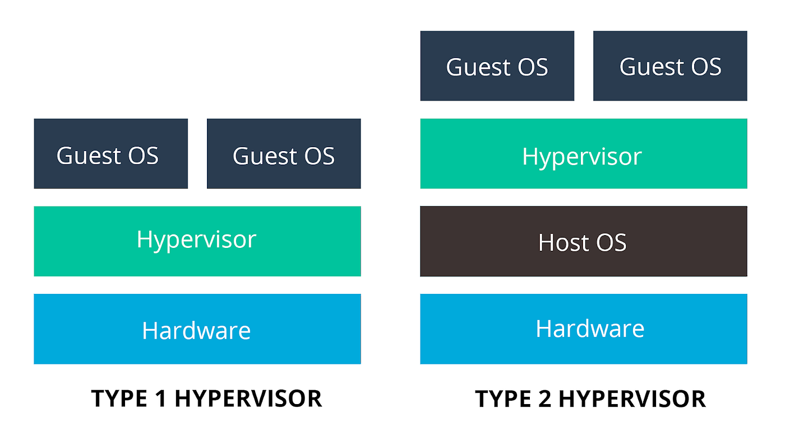
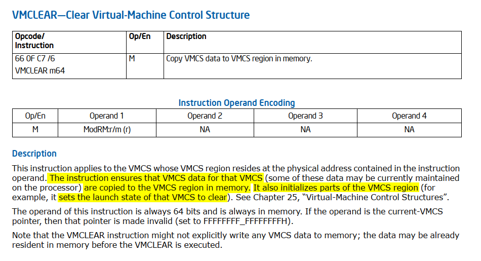
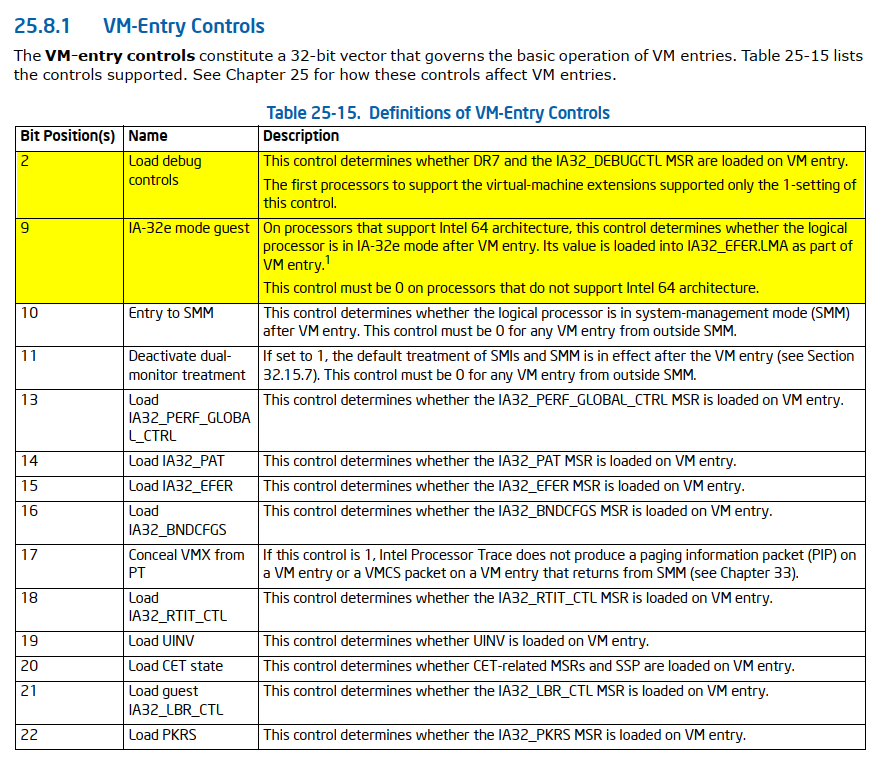
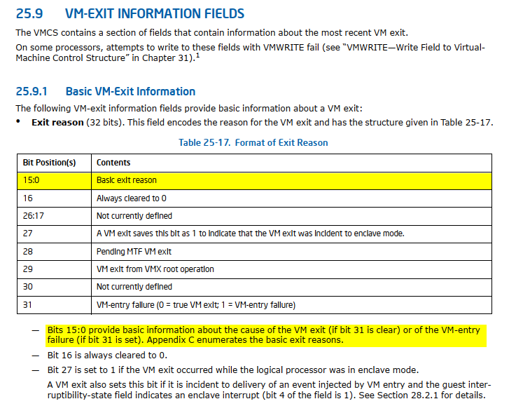

## **Introduction**
Recently, I explored [Intel VT-x](https://web.archive.org/web/20230606085227/https://www.intel.com/content/www/us/en/virtualization/virtualization-technology/intel-virtualization-technology.html) technology. To deepen my understanding, I took on a CTF challenge focused on reverse-engineering a hypervisor. Documenting this experience will help me solidify and retain what I’ve learned. While this post doesn’t present groundbreaking content beyond what’s already available online, I aim to share my reverse-engineering approach. My goal is to provide a detailed exploration of these topics, making it easy for readers of different knowledge levels to follow.  

> Two effective ways to retain knowledge are through **practical** application, like participating in CTFs, and **sharing** it with others, as I aim to do in this blog post.

## **The challenge**
This challenge is from [Flare-On](https://flare-on.com/)'s 2018 annual CTF.  
You can download the challenges [here](https://flare-on.com/files/Flare-On5_Challenges.zip) (password: infected).  

## **golf.exe**
The description of the challenge is:  

> How about a nice game of golf? Did you bring a visor? Just kidding, you're not going outside any time soon. You're going to be sitting at your computer all day trying to solve this.  

Okay, let's start.  
Let's run `golf.exe` to observe its behavior.  
However, an error occurs:  


### **golf - initial analysis**
Before diving into reverse engineering the binary, our initial step involves examining key technical aspects. This includes identifying the compiler used, assessing whether the file is packed, reviewing its imports, uncovering notable strings, and identifying embedded resources.  

> Identifying packers and anti-analysis techniques early helps determine whether static analysis is sufficient or if dynamic analysis is needed.  

We can load the binary into [Detect It Easy](https://github.com/horsicq/Detect-It-Easy) (DiE):  


The file was compiled with MSVC and is not packed:  


Next, let's examine the imports. Here are some that stand out:  
* [RegCloseKey](https://learn.microsoft.com/en-us/windows/win32/api/winreg/nf-winreg-regclosekey), [RegCreateKeyExA](https://learn.microsoft.com/en-us/windows/win32/api/winreg/nf-winreg-regcreatekeyexa), [RegDeleteKeyA](https://learn.microsoft.com/en-us/windows/win32/api/winreg/nf-winreg-regdeletekeya), [RegDeleteValueA](https://learn.microsoft.com/en-us/windows/win32/api/winreg/nf-winreg-regdeletevaluea),
[RegQueryValueExA](https://learn.microsoft.com/en-us/windows/win32/api/winreg/nf-winreg-regqueryvalueexa), [RegSetValueExA](https://learn.microsoft.com/en-us/windows/win32/api/winreg/nf-winreg-regsetvalueexa) - Windows API functions related to registry operations.  
* [AdjustTokenPrivileges](https://learn.microsoft.com/en-us/windows/win32/api/securitybaseapi/nf-securitybaseapi-adjusttokenprivileges), [LookupPrivilegeValueA](https://learn.microsoft.com/en-us/windows/win32/api/winbase/nf-winbase-lookupprivilegevaluea), [OpenProcessToken](https://learn.microsoft.com/en-us/windows/win32/api/processthreadsapi/nf-processthreadsapi-openprocesstoken) - Windows API functions related to managing process privileges.  
* [CreateFileA](https://learn.microsoft.com/en-us/windows/win32/api/fileapi/nf-fileapi-createfilea), [DeleteFileA](https://learn.microsoft.com/en-us/windows/win32/api/fileapi/nf-fileapi-deletefilea), [WriteFile](https://learn.microsoft.com/en-us/windows/win32/api/fileapi/nf-fileapi-writefile) - Windows API functions related to file handling.  
* [GetCurrentProcess](https://learn.microsoft.com/en-us/windows/win32/api/processthreadsapi/nf-processthreadsapi-getcurrentprocess), [GetCurrentProcessId](https://learn.microsoft.com/en-us/windows/win32/api/processthreadsapi/nf-processthreadsapi-getcurrentprocessid), [GetCurrentThreadId](https://learn.microsoft.com/en-us/windows/win32/api/processthreadsapi/nf-processthreadsapi-getcurrentthreadid) - Windows API functions are used to obtain information about the current process and threads.  
* [VirtualAlloc](https://learn.microsoft.com/en-us/windows/win32/api/memoryapi/nf-memoryapi-virtualalloc), [VirtualFree](https://learn.microsoft.com/en-us/windows/win32/api/memoryapi/nf-memoryapi-virtualfree), [VirtualLock](https://learn.microsoft.com/en-us/windows/win32/api/memoryapi/nf-memoryapi-virtuallock), [VirtualUnlock](https://learn.microsoft.com/en-us/windows/win32/api/memoryapi/nf-memoryapi-virtualunlock) - Windows API functions are used for memory management and manipulation.  
* [GetProcAddress](https://learn.microsoft.com/en-us/windows/win32/api/libloaderapi/nf-libloaderapi-getprocaddress) - Windows API function used for dynamically retrieving the address of an exported function or variable from a specified PE.  

Lastly, the strings:  
* %s@flare-on.com
* **C:\fhv.sys**
* ErrorControl
* ImagePath
* SYSTEM\CurrentControlSet\Control
* SYSTEM\CurrentControlSet\services\fhv
* **SeLoadDriverPrivilege**
* Start
* SystemStartOptions
* TESTSIGNING
* Too bad so saddd %x
* **ZwLoadDriver**
* ZwUnloadDriver
* \??\%s\fhv.sys
* \Registry\Machine\System\CurrentControlSet\Services\fhv
* ntdll
* t:\objchk_win7_amd64\amd64\golf.pdb

The most obvious clue from the strings is that the program will likely drop a driver file named `fhv.sys` onto the disk and then load it. Additionally, we see the strings [ZwLoadDriver](http://undocumented.ntinternals.net/index.html?page=UserMode%2FUndocumented%20Functions%2FExecutable%20Images%2FNtLoadDriver.html), and [ZwUnloadDriver](http://undocumented.ntinternals.net/index.html?page=UserMode%2FUndocumented%20Functions%2FExecutable%20Images%2FNtUnloadDriver.html) [^1], but they don’t appear in the imports. This indicates they are likely resolved at runtime through the [GetProcAddress](https://learn.microsoft.com/en-us/windows/win32/api/libloaderapi/nf-libloaderapi-getprocaddress) function, which does appear in the imports.

### **golf - static analysis**
#### **Finding the main function**
After loading the binary in IDA Pro, we notice that no symbols are present, indicating the binary has been stripped[^2]. Several methods exist to locate the main function, such as searching for string references and key functions and connecting the dots. Since the compiler used is MSVC, locating the main function is relatively straightforward.  

As we saw when running the program earlier in the command prompt, its output was displayed in the console. Checking the [IMAGE_OPTIONAL_HEADER64](https://learn.microsoft.com/en-us/windows/win32/api/winnt/ns-winnt-image_optional_header64).[Subsystem](https://learn.microsoft.com/en-us/windows/win32/debug/pe-format#windows-subsystem) confirms this. In console programs, the `AddressOfEntryPoint` is set to the `mainCRTStartup` (or `wmainCRTStartup`) function. An online search for `mainCRTStartup` can [reveal useful information](https://www.cnblogs.com/hed10ne/p/17527277.html).  

`mainCRTStartup` looks like this:  
```c
DWORD mainCRTStartup(LPVOID) {
    _security_init_cookie();
    return _scrt_common_main_seh();
}
```

Therefore, the first function call to `sub_100049B30` corresponds to `_security_init_cookie`:  
```c
__int64 _security_init_cookie() {
    __int64 result; // rax
    struct _FILETIME v1; // rbx
    unsigned __int64 v2; // rbx
    unsigned __int64 v3; // rbx
    unsigned __int64 v4; // rbx
    LONGLONG v5; // r11
    struct _FILETIME SystemTimeAsFileTime; // [rsp+30h] [rbp+8h] BYREF
    LARGE_INTEGER PerformanceCount; // [rsp+38h] [rbp+10h] BYREF

    SystemTimeAsFileTime = 0 i64;
    if (qword_10004B110 == 0x2B992DDFA232 i64) {
        GetSystemTimeAsFileTime( & SystemTimeAsFileTime);
        v1 = SystemTimeAsFileTime;
        v2 = GetCurrentProcessId() ^ * (unsigned __int64 * ) & v1;
        v3 = GetCurrentThreadId() ^ v2;
        v4 = GetTickCount() ^ v3;
        QueryPerformanceCounter( & PerformanceCount);
        v5 = (v4 ^ PerformanceCount.QuadPart) & 0xFFFFFFFFFFFF i64;
        result = 0x2B992DDFA233 i64;
        if (v5 == 0x2B992DDFA232 i64)
            v5 = 0x2B992DDFA233 i64;
        qword_10004B110 = v5;
        qword_10004B118 = ~v5;
    } else {
        result = ~qword_10004B110;
        qword_10004B118 = ~qword_10004B110;
    }
    return result;
}
```

We can confirm this again by searching online—this time for the constant `0x2B992DDFA232`, which provides [promising](https://gist.github.com/joshfinley/7e01480ab70ade5f7d296cc4e37684e1#file-gs_support-c-L157) [results](https://gist.github.com/joshfinley/7e01480ab70ade5f7d296cc4e37684e1#file-gs_support-c-L41). We can apply the same method to the next function, `sub_100049668` (`__scrt_common_main`). After some basic reverse engineering, we identified that the main function is `sub_100001C10`.

#### **main**
First, `argv[1]` must be exactly `0x18` bytes long.  
Next, there is a call to `sub_100001A60`, which performs the following tasks:  
1. Calls `sub_100001A73` to execute `CPUID` with `EAX` set to `0x40000001` and perform a calculation based on the result of the `EAX` register. What information does `0x40000001` provide? Searching for `0x40000001` in the [Intel SDM](https://www.intel.com/content/www/us/en/developer/articles/technical/intel-sdm.html) yields no results. Although the `CPUID` documentation provides some context, it doesn’t directly answer the question:  
  
Again, searching for `CPUID 0x40000001` online can provide us with the [answer](https://learn.microsoft.com/en-us/virtualization/hyper-v-on-windows/tlfs/feature-discovery).  
The calculation routine (`sub_1000014C0`) takes a DWORD array (`dword_10004B140`) as an argument. This array contains constant values, which, after a quick search, are found to be used for a CRC32 checksum. The CRC32 result is then compared with the hardcoded value `0x5C139D95`. If they do not match, the program proceeds as usual. The purpose of this check is currently unknown. While there could be several reasons for it, the important thing is that it does not impede our progress, so we can disregard it for now. Additionally, since the input is based on `EAX` (`4`-byte value), we can attempt all possible inputs (`0x00000000` - `0xFFFFFFFF`) to find the "correct" input that matches the check.  

1. Calls `sub_100001590` to check whether the [TESTSIGNING](https://learn.microsoft.com/en-us/windows-hardware/drivers/install/the-testsigning-boot-configuration-option) mode is enabled; if so, proceed with execution.  

2. Calls `sub_1000021C0` to dump the embedded driver file to `C:\fhv.sys`.  
NOTE: If you attempt to use the decompiler or view the `sub_1000021C0` function in graph mode, you will encounter an error stating "too big function" or "Sorry, this node is too big to display".
This happens because the `fhv.sys` file is stored as an array on the stack, which **significantly** increases the size of the function. A workaround for the decompilation can be found [here](https://hex-rays.com/blog/igors-tip-of-the-week-166-dealing-with-too-big-function/). For the graph view, click the button shown in the following figure:  
  
To extract the `fhv.sys` binary, we can let the program do the job for us and dump it to the disk.  

1. Calls `sub_100001700` to resolve the [ZwLoadDriver](http://undocumented.ntinternals.net/index.html?page=UserMode%2FUndocumented%20Functions%2FExecutable%20Images%2FNtLoadDriver.html) function using [GetProcAddress](https://learn.microsoft.com/en-us/windows/win32/api/libloaderapi/nf-libloaderapi-getprocaddress), adjust the current process [privileges](https://learn.microsoft.com/en-us/windows/win32/secauthz/privilege-constants) to include `SeLoadDriverPrivilege`, register the new driver in the registry, and finally call `ZwLoadDriver` to load the driver.

Returning to the `main` function, the next step is to allocate a buffer using [VirtualAlloc](https://learn.microsoft.com/en-us/windows/win32/api/memoryapi/nf-memoryapi-virtualalloc). This buffer is allocated with `read`, `write`, and `execute` permissions. Subsequently, `0x1C` bytes are copied from `unk_10004B120` to the allocated buffer (`lpAddress`), followed by four function calls. Each function receives an offset from our `argv[1]` and a pointer to the allocated buffer:  
```c
int __fastcall main(int argc, const char ** argv, const char ** envp) {
    /* ... (code omitted for brevity) ... */

    lpAddress = VirtualAlloc(NULL, 0x1000, MEM_RESERVE | MEM_COMMIT, PAGE_EXECUTE_READWRITE);
    if (!lpAddress ||
        (qmemcpy(lpAddress, & unk_10004B120, 0x1C), sub_100001E40(argv[1], lpAddress)) &&
        sub_100001F20(argv[1] + 5, lpAddress) &&
        sub_100002000(argv[1] + 0xE, lpAddress) &&
        sub_1000020E0(argv[1] + 0x13, lpAddress))
        {
            ret = 0;
        }

    /* ... (code omitted for brevity) ... */

    if (ret)
        printf("Too bad so saddd %x\n", ret);
    else
        printf("%s@flare-on.com\n", argv[1]);
    return ret;
}
```

Since the `lpAddress` buffer is allocated with `read`, `write`, and `execute` permissions, it's a strong indication that it likely holds executable code. Therefore, we can try disassembling `unk_10004B120` to examine its contents:  
```nasm
.data:000000010004B120 sub_10004B120   proc near               ; DATA XREF: sub_100001C10+106↑o
.data:000000010004B120                 vmcall
.data:000000010004B123                 jz      short loc_10004B133
.data:000000010004B125                 jb      short loc_10004B12B
.data:000000010004B127                 xor     rax, rax
.data:000000010004B12A                 retn
.data:000000010004B12B ; ---------------------------------------------------------------------------
.data:000000010004B12B
.data:000000010004B12B loc_10004B12B:                          ; CODE XREF: sub_10004B120+5↑j
.data:000000010004B12B                 mov     rax, 2
.data:000000010004B132                 retn
.data:000000010004B133 ; ---------------------------------------------------------------------------
.data:000000010004B133
.data:000000010004B133 loc_10004B133:                          ; CODE XREF: sub_10004B120+3↑j
.data:000000010004B133                 mov     rax, 1
.data:000000010004B13A                 retn
.data:000000010004B13A sub_10004B120   endp
.data:000000010004B13A
.data:000000010004B13A ; ---------------------------------------------------------------------------
.data:000000010004B13B                 db    0
.data:000000010004B13C                 db 0EFh
```

> Additionally, we can verify this by examining the four function calls, which each make a call into the `lpAddress` buffer.  

The first instruction is a special one called `VMCALL`. What does the `VMCALL` instruction do? Let’s refer to the Intel SDM again.  

##### **VMCALL**


But what does "Call to VM monitor by causing VM exit" mean? Now, it's time to dive into hypervisors.  

## **Hypervisors**

> Before we continue, I want to clarify that this post is not intended to teach hypervisor development, as there are many excellent guides available for that. Instead, this post will focus on understanding hypervisors from a reverse-engineering perspective. In addition, [Intel VT-x](https://web.archive.org/web/20230606085227/https://www.intel.com/content/www/us/en/virtualization/virtualization-technology/intel-virtualization-technology.html) technology is vast, so I'll cover only the essential aspects needed for this challenge.  

> Disclosure: I used ChatGPT to write some non-technical parts about hypervisors.  

### **What is a Hypervisor?**
A hypervisor, also known as a [Virtual Machine Monitor](https://en.wikipedia.org/wiki/Hypervisor) (VMM), is software that creates and manages [virtual machines](https://en.wikipedia.org/wiki/Virtual_machine) (VMs) on a host system. It enables multiple operating systems to run concurrently on a single physical machine by abstracting hardware resources and providing each VM with its own virtualized environment. Modern hypervisors leverage hardware extensions such as [Intel VT-x](https://web.archive.org/web/20230606085227/https://www.intel.com/content/www/us/en/virtualization/virtualization-technology/intel-virtualization-technology.html) and [AMD-V](https://en.wikipedia.org/wiki/X86_virtualization#AMD_virtualization_(AMD-V)) to enhance performance and security by providing efficient virtualization capabilities directly supported by the CPU.  

### **Types of Hypervisors**
There are [two](https://web.archive.org/web/20230324153721/https://vapour-apps.com/what-is-hypervisor/) types of hypervisors: `Type 1`, also known as native or bare-metal hypervisors, and `Type 2`, commonly called hosted hypervisors.  

#### **Type 1 Hypervisors (Bare-Metal)**
* Definition: Run directly on the host's hardware to manage guest operating systems, without requiring a host OS.
* Examples: VMware ESXi, Microsoft Hyper-V, Xen.
* Characteristics: High performance, efficient, commonly used in enterprise environments, and more secure due to a minimalistic hypervisor layer.

#### **Type 2 Hypervisors (Hosted)**
* Definition: Run on a conventional operating system as a software layer or application.
* Examples: VMware Workstation, Oracle VM VirtualBox, Parallels Desktop.
* Characteristics: Easier to set up, suitable for personal use, development, and testing, though slightly less efficient due to the overhead of the host OS.



As you’ve probably noticed, our challenge runs on top of the operating system, making it a `type 2 hypervisor`.  

### **Core Components of Intel VT-x**
Intel VT-x is a set of hardware extensions that provide robust support for virtualization. It enables efficient creation and management of virtual machines by providing features that enhance performance and security.  
In the following sections, we will cover the key aspects of Intel VT-x.  

#### **VMX - Virtual Machine Extensions**  
VMX is a set of instructions that enable virtualization on Intel processors. It introduces new CPU operation modes that facilitate the management of virtual machines. The **two** primary modes are **VMX root mode** (for the hypervisor) and **VMX non-root mode** (for guest VMs).  

Let's examine the most <u> relevant </u> VMX instructions for this post:  

| Intel Mnemonic |                     Description                    | Entering mode
|----------------|:--------------------------------------------------:|:-----------------:|
| VMXON          | Enter VMX Operation                                | VMX root mode     |
| VMXOFF         | Leave VMX Operation                                |                   |
| VMCLEAR        | Clear Virtual-Machine Control Structure            |                   |
| VMPTRLD        | Load Pointer to Virtual-Machine Control Structure  |                   |
| VMREAD         | Read Field from Virtual-Machine Control Structure  |                   |
| VMWRITE        | Write Field to Virtual-Machine Control Structure   |                   |
| VMLAUNCH       | Launch Virtual Machine                             | VMX non-root mode |
| VMRESUME       | Resume Virtual Machine                             | VMX non-root mode |
| VMCALL         | Call to VM Monitor                                 | VMX root mode     |


####  **VMCS - Virtual Machine Control Structure**
The VMCS is a crucial data structure in Intel VT-x that controls the behavior of virtual machines. It stores state information for the **guest** and the **hypervisor**, managing transitions between them.  

The VMCS includes fields for:  
* **Guest-State Area**: Stores (**saves**) the state of the guest VM (e.g., segment registers, control registers) when the VM is not running, i.e., during a VM-exit.
* **Host-State Area**: Stores the state of the hypervisor (host) to be **loaded** when the guest VM exits.
* **VM-Execution Control Fields**: Configure how the guest VM operates, specifying which events and instructions cause VM exits.
* **VM-Exit Control Fields**: Define the conditions under which the processor exits from the guest VM to the hypervisor.
* **VM-Entry Control Fields**: Manage the conditions for entering a guest VM from the hypervisor.

There is a picture that illustrates and catalogs VMCS fields in a cool way:  


#### **Extended Page Tables (EPT) and Virtual Processor ID (VPID)**
**Extended Page Tables** (EPT) is a hardware-assisted memory virtualization feature that offers a [Second Level of Address Translation](https://en.wikipedia.org/wiki/Second_Level_Address_Translation) (SLAT). It maps guest physical addresses to host physical addresses, enabling the hypervisor to manage memory more efficiently and securely. EPT reduces the overhead associated with traditional software-based memory management techniques.  


**Virtual Processor ID** (VPID) is a feature that assigns unique identifiers to each virtual processor, enabling the processor to maintain separate caches for each VM. This minimizes the overhead of cache flushing during VM switches and enhances performance.  

This may seem complex for those without prior experience with Intel VT-x, but don't worry—you don't need to remember everything. Things will become clearer in the upcoming sections.  

## **fhv.sys**

### **fhv - initial analysis**
The file is compiled with MSVC and the file is not packed.  
Let's examine the imports. Here are some that stand out:  
* [WdfVersionBind](https://github.com/microsoft/Windows-Driver-Frameworks/blob/a94b8c30dad524352fab90872aefc83920b98e56/src/framework/shared/inc/private/common/fxldr.h#L398), `WdfVersionBindClass`, [WdfVersionUnbind](https://github.com/microsoft/Windows-Driver-Frameworks/blob/a94b8c30dad524352fab90872aefc83920b98e56/src/framework/shared/inc/private/common/fxldr.h#L406), `WdfVersionUnbindClass` - Part of the [Windows Driver Frameworks](https://learn.microsoft.com/en-us/windows-hardware/drivers/wdf/) (WDF).  
* [MmAllocateContiguousMemory](https://learn.microsoft.com/en-us/windows-hardware/drivers/ddi/wdm/nf-wdm-mmallocatecontiguousmemory), [MmFreeContiguousMemory](https://learn.microsoft.com/en-us/windows-hardware/drivers/ddi/wdm/nf-wdm-mmfreecontiguousmemory), [MmGetPhysicalAddress](https://learn.microsoft.com/en-us/windows-hardware/drivers/ddi/ntddk/nf-ntddk-mmgetphysicaladdress), [MmGetPhysicalMemoryRanges](https://learn.microsoft.com/en-us/windows-hardware/drivers/ddi/ntddk/nf-ntddk-mmgetphysicalmemoryrangesex2), [MmGetVirtualForPhysical](https://rayanfam.com/topics/inside-windows-page-frame-number-part2/) - These functions are part of the Windows kernel-mode memory management routines.  
* [MmGetSystemRoutineAddress](https://learn.microsoft.com/en-us/windows-hardware/drivers/ddi/wdm/nf-wdm-mmgetsystemroutineaddress) - Windows kernel-mode function used to retrieve the address of a system routine (function) given its name. `MmGetSystemRoutineAddress` and `GetProcAddress` serve **similar** purposes in **different contexts**.  
* [RtlCompareMemory](https://learn.microsoft.com/en-us/windows-hardware/drivers/ddi/wdm/nf-wdm-rtlcomparememory), [strcmp](https://learn.microsoft.com/en-us/cpp/c-runtime-library/reference/strcmp-wcscmp-mbscmp?view=msvc-170) - `RtlCompareMemory` and `strcmp` are functions used for comparing memory and strings, respectively.  
* [KdDebuggerNotPresent](https://github.com/mic101/windows/blob/6c4cf038dbb2969b1851511271e2c9d137f211a9/WRK-v1.2/base/ntos/inc/kd.h#L162), [RtlGetVersion](https://learn.microsoft.com/en-us/windows-hardware/drivers/ddi/wdm/nf-wdm-rtlgetversion) - `KdDebuggerNotPresent` checking the presence of a kernel debugger, and `RtlGetVersion` is used for retrieving the operating system version information.  

Lastly, the strings found within the binary:  
* KmdfLibrary
* ASDASDASDASDASDASDASDASDASDASDASDASDASDASDASDASDASDASDASDASDASD\toobadsoosadd.pdb

This is a [KMDF](https://en.wikipedia.org/wiki/Kernel-Mode_Driver_Framework) driver. We won't delve into the [differences between WDM and WDF](https://learn.microsoft.com/en-us/windows-hardware/drivers/wdf/differences-between-wdm-and-kmdf) or the methods for reverse-engineering KMDF drivers, as there are [many](https://ioactive.com/wp-content/uploads/2018/09/Reverse_Engineering_and_Bug_Hunting_On_KMDF_Drivers.pdf) [resources](https://blogs.vmware.com/security/2023/10/hunting-vulnerable-kernel-drivers.html) available that cover these topics.  

### **fhv - static analysis**
#### **FxDriverEntry**
The only noteworthy part of `FxDriverEntry` is its call to `sub_14000D000`.  

#### **sub_14000D000**
* Calls `sub_14000D0E4` to check if the operating system is Windows Vista or newer, based on [RtlGetVersion]((https://learn.microsoft.com/en-us/windows-hardware/drivers/ddi/wdm/nf-wdm-rtlgetversion)) [output](https://learn.microsoft.com/en-us/windows-hardware/drivers/ddi/wdm/ns-wdm-_osversioninfoexw#remarks):  
```c
bool sub_14000D0E4() {
    struct _OSVERSIONINFOW VersionInformation; // [rsp+20h] [rbp-138h] BYREF

    memset(&VersionInformation, 0, sizeof(VersionInformation));
    // dwMajorVersion 6 = Windows Vista and up
    return RtlGetVersion(&VersionInformation) >= 0 && ((VersionInformation.dwMajorVersion - 6) & -5) == 0;
}
```  
* Calls `sub_14000D180` and `sub_14000B73C`; details on these will be provided in the next sections.  
* Calls `sub_14000D0BA` with `0x13687456` as an argument, which is then passed to `sub_140002F9E` to execute a `VMCALL` instruction. After reviewing `sub_14000D180`, `sub_14000B73C`, and their subroutines, we will revisit `sub_14000D0BA`.

#### **sub_14000D180**
`sub_14000D180` begins with a call to `RtlGetVersion`, followed by a condition that checks whether the system matches a specific build version:  
```c
NTSTATUS __fastcall sub_14000D180(__int64 a1) {
    /* ... (code omitted for brevity) ... */
    VersionInformation.dwOSVersionInfoSize = 0x114;
    memset(&VersionInformation.dwMajorVersion, 0, 0x11064);
    ntstatus = RtlGetVersion(&VersionInformation);

    if (VersionInformation.dwMajorVersion < 10 || VersionInformation.dwBuildNumber < 14316)  // [1]
    {
        qword_140008C50 = qword_140007000;  // [2]
        qword_140008C58 = qword_140007008;
        qword_140008C60 = qword_140007010;
        qword_140008C68 = qword_140007018;
    } else {
        pfn_MmGetVirtualForPhysical = (char *)wrap_MmGetSystemRoutineAddress(L"MmGetVirtualForPhysical");  // [3]
        if (!pfn_MmGetVirtualForPhysical) return STATUS_PROCEDURE_NOT_FOUND;
        v5 = wrapper_RtlCompareMemory(pfn_MmGetVirtualForPhysical, 0x30, &unk_140006150, 0xA);  // [4]
        if (!v5) return STATUS_PROCEDURE_NOT_FOUND;
        qword_140008C68 = *(_QWORD *)(v5 + 0xA);                             // [5]
        v6 = ((unsigned __int64)qword_140008C68 >> 0x27) & 0x1FF;            // [6]
        qword_140008C58 = qword_140008C68 | (v6 << 0x1E) | (v6 << 0x15);     // [7]
        qword_140008C50 = qword_140008C58 | (v6 << 0xC);                     // [8]
        qword_140008C60 = qword_140008C68 | (v6 << 0x1E);                    // [9]
    }
    /* ... (code omitted for brevity) ... */
}
```

**At [1]**, the condition checks whether the OS build is less than `14316`. If the condition is met, the code in **[2]** is executed. An online search reveals that build `14316` corresponds to the [Windows 10 Anniversary Update](https://en.wikipedia.org/wiki/Windows_10,_version_1607) (also known as version 1607, codenamed Redstone 1). **At [2]**, the code initializes four global variables based on the values of four other global variables. Let's examine the values of `qword_140007000`, `qword_140007008`, `qword_140007010`, and `qword_140007018`:  
```
.data:0000000140007000 qword_140007000 dq 0FFFFF6FB7DBED000h   ; DATA XREF: sub_14000D180:loc_14000D270↓r
.data:0000000140007008 qword_140007008 dq 0FFFFF6FB7DA00000h   ; DATA XREF: sub_14000D180+104↓r
.data:0000000140007010 qword_140007010 dq 0FFFFF6FB40000000h   ; DATA XREF: sub_14000D180+112↓r
.data:0000000140007018 qword_140007018 dq 0FFFFF68000000000h   ; DATA XREF: sub_14000D180+120↓r
```

For those with familiarity and experience in Windows Internals and Windows kernel exploitation, these values will be familiar. However, for those who are not, a quick online search for these values will provide clarity. Those values are important constants related to the Windows memory management system, specifically for the [paging](https://connormcgarr.github.io/paging/) structures in 64-bit Windows. So according to those values we can rename `qword_140007000`, `qword_140007008`, `qword_140007010`, and `qword_140007018` to: `g_PML4_BASE_before_rs1`, `g_PDP_BASE__before_rs1`, `g_PD_BASE_before_rs1`, `g_PT_BASE_before_rs1`, respectively.  
What’s special about the `Windows 10 Anniversary Update`? It [turns out](https://github.com/nccgroup/exploit_mitigations/blob/main/windows_mitigations.md) that in this version, [Microsoft](https://x.com/epakskape/status/864882030110138369) decided to [place the paging structures at random addresses](https://www.alex-ionescu.com/owning-the-image-object-file-format-the-compiler-toolchain-and-the-operating-system-solving-intractable-performance-problems-through-vertical-engineering/).  

Now let's see what happens if our OS build is greater than `14316` build.  
The code **at [3]** retrieves the address of `MmGetVirtualForPhysical`. Then, **at [4]**, it calls `wrapper_RtlCompareMemory` (`sub_140002EF8`), which compares the bytes from `MmGetVirtualForPhysical` with those from `unk_140006150` and returns the number of bytes that match until the first difference.  
Let's examine the disassembly of `unk_140006150`:  
```nasm
.rdata:0000000140006150 48 8B 04 D0                             mov     rax, [rax+rdx*8]
.rdata:0000000140006154 48 C1 E0 19                             shl     rax, 19h
.rdata:0000000140006154                         ; ---------------------------------------------------------------------------
.rdata:0000000140006158 48                                      db  48h ; H
.rdata:0000000140006159 BA                                      db 0BAh
```

Now let's open `ntoskrnl.exe` in IDA, and examine the disassembly of `MmGetVirtualForPhysical`:  
```nasm
.text:00000001403B1C20                         ; PVOID __stdcall MmGetVirtualForPhysical(PHYSICAL_ADDRESS PhysicalAddress)
.text:00000001403B1C20                                         public MmGetVirtualForPhysical
.text:00000001403B1C20                         MmGetVirtualForPhysical proc near       ; DATA XREF: .pdata:00000001400E79C8↑o
.text:00000001403B1C20 48 8B C1                                mov     rax, rcx
.text:00000001403B1C23 48 C1 E8 0C                             shr     rax, 0Ch
.text:00000001403B1C27 48 8D 14 40                             lea     rdx, [rax+rax*2]
.text:00000001403B1C2B 48 03 D2                                add     rdx, rdx
.text:00000001403B1C2E 48 B8 08 00 00 00 00 DE                 mov     rax, 0FFFFDE0000000008h
.text:00000001403B1C2E FF FF
.text:00000001403B1C38 48 8B 04 D0                             mov     rax, [rax+rdx*8]
.text:00000001403B1C3C 48 C1 E0 19                             shl     rax, 19h
.text:00000001403B1C40 48 BA 00 00 00 00 80 F6                 mov     rdx, 0FFFFF68000000000h
.text:00000001403B1C40 FF FF
.text:00000001403B1C4A 48 C1 E2 19                             shl     rdx, 19h
.text:00000001403B1C4E 81 E1 FF 0F 00 00                       and     ecx, 0FFFh
.text:00000001403B1C54 48 2B C2                                sub     rax, rdx
.text:00000001403B1C57 48 C1 F8 10                             sar     rax, 10h
.text:00000001403B1C5B 48 03 C1                                add     rax, rcx
.text:00000001403B1C5E C3                                      retn
.text:00000001403B1C5E                         MmGetVirtualForPhysical endp
```

The `wrapper_RtlCompareMemory` function returns the address of the matching pattern, which in this case is the instruction `mov rax, [rax+rdx*8]` within `MmGetVirtualForPhysical`. **At [5]**, it adds `0xA` to this address, extracts a qword from the resulting address, and stores it in `qword_140008C68` (`g_PT_BASE`). Essentially, the code is trying to extract the value `0xFFFFF68000000000` from the instruction `mov rdx, 0FFFFF68000000000h`. However, the actual value may vary at runtime due to the page table randomization mitigation introduced by the Windows 10 Anniversary Update. **Between [6] and [9]**, the code then constructs the rest of the paging structure base addresses based on the `PT_BASE` value.  

Next, `sub_14000D180` calls `sub_14000D36C`. This function creates a custom data structure mapping the system's physical memory layout, which is then used to configure EPT structures—details of which are outside the scope of this post.  

> Why is `sub_14000D180` covered? Spoiler alert:  
The global variables initialized by this function (e.g., `g_PML4_BASE`) are not actively used. The function is discussed here because it provides valuable insights into reverse engineering methodology, touching on Windows internals and kernel exploitation. Gaining experience enhances your ability to recognize patterns and constants more readily. The approach shown for identifying memory addresses of paging data structures by pattern matching is applied in real-world exploits. By using kernel read primitives, these addresses can be leaked, enabling the calculation of Virtual Address (VA) to Page Table Entry (PTE) mappings, which then can be used for [PTE manipulation attacks](https://www.coresecurity.com/sites/default/files/private-files/publications/2016/05/CSW2016%20-%20Getting%20Physical%20-%20Extended%20Version.pdf).  

#### **sub_14000B73C**
As we dive deeper, this function reveals some of its most intriguing aspects:  
```c
NTSTATUS sub_14000B73C() {
    __int64 result;   // rax
    __int64 v16;      // rdx
    char v17;         // bl
    __int64 v18;      // rbx
    unsigned int v19; // ebx

    _RAX = 1;
    __asm { cpuid }        // [1]
    if ((int)_RCX < 0) {   // [2]
        _RAX = 0x40000001; // [3]
        __asm { cpuid }
        if ((_DWORD)_RAX == 0x56484C46) // [4]
            return STATUS_CANCELLED;
    }
    _RAX = 1;
    __asm { cpuid }         // [5]
    if ((_RCX & 0x20) == 0) // [6]
        return STATUS_HV_FEATURE_UNAVAILABLE;
    if ((((sub_140002F80(0x480) >> 0x20) >> 0x12) & 0xF) != 6) // [7]
        return STATUS_HV_FEATURE_UNAVAILABLE;
    v17 = sub_140002F80(0x3A);                                 // [8]
    if ((v17 & 1) == 0 && sub_14000B624(sub_14000BDE0, 0) < 0) // [9]
        return STATUS_HV_FEATURE_UNAVAILABLE;
    if ((v17 & 4) == 0 || !sub_14000B5A4()) // [10]
        return STATUS_HV_FEATURE_UNAVAILABLE;
    v18 = sub_14000BAC4(); // [11]
    if (!v18)
        return STATUS_MEMORY_NOT_ALLOCATED;
    sub_14000B330();                            // [12]
    result = sub_14000B624(sub_14000C614, v18); // [13]
    v19 = result;
    if (result < STATUS_SUCCESS) {
        sub_14000B624(sub_14000C638, 0); // [14]
        return v19;
    }
    return result;
}
```
From this point forward, the Intel SDM - `Volume 3 (3A, 3B, 3C & 3D): System Programming Guide` will be our primary reference.  
**At [1]**, the code executes `CPUID` with `EAX` set to `1`, and then **at [2]**, it checks whether `RCX` is negative. This check essentially means, 'Is the [MSB](https://en.wikipedia.org/wiki/Bit_numbering) set?' The `CPUID - Initial EAX Value = 1` documentation in the SDM provides some information, though it doesn't necessarily bring us closer to the answer:  


Again, searching for `CPUID 1` online can provide us with the [answer](https://en.wikipedia.org/wiki/CPUID#EAX=1:_Processor_Info_and_Feature_Bits):  


If the hypervisor present bit is set, the code **at [3] and [4]** will be executed. **At [3]**, `CPUID` is executed again with `EAX` set to `0x40000001`, which we’ve already seen in [golf!sub_100001A73](#main). **At [4]**, it checks if `EAX` equals `0x56484C46` (`VHLF`), and if true, the function will abort with `STATUS_CANCELLED`. We can infer that the test in `golf!sub_100001A73` likely uses the `CPUID` input value of `0x56484C46`, causing the condition to be true. This test seems to confirm whether the driver has already been executed and initialized. If the driver is loaded again, this code will prevent it from running again the initialization code.  

Next, **at [5]**, the `CPUID` instruction is executed again with `EAX` set to `1`. Then, **at [6]**, it checks whether the **5th** bit of `RCX` is unset. Let's refer to the SDM for more details:  


Additionally, the `Introduction to Virtual Machine Extensions` chapter includes a section called `Discovering Support for VMX` that describes this process in detail:  
> **DISCOVERING SUPPORT FOR VMX**  
Before system software enters into VMX operation, it must discover the presence of VMX support in the processor.  
System software can determine whether a processor supports VMX operation using **CPUID**. If
**CPUID.1:ECX.VMX[bit 5] = 1**, then VMX operation is supported. See Chapter 3, “Instruction Set Reference, A-L” of
Intel® 64 and IA-32 Architectures Software Developer’s Manual, Volume 2A.  
The VMX architecture is designed to be extensible so that future processors in VMX operation can support additional features not present in first-generation implementations of the VMX architecture. The availability of extensible VMX features is reported to software using a set of VMX capability MSRs (see Appendix A, “VMX Capability
Reporting Facility”).  

Next, **at [7] and [8]** there is a call to `sub_140002F80`, let's take a look at `sub_140002F80`:  
```nasm
.text:0000000140002F80                         ; unsigned __int64 __fastcall sub_140002F80(unsigned int)
.text:0000000140002F80                         sub_140002F80   proc near               ; CODE XREF: sub_140003144+D8↓p
.text:0000000140002F80                                                                 ; sub_140003144+E5↓p ...
.text:0000000140002F80 0F 32                                   rdmsr
.text:0000000140002F82 48 C1 E2 20                             shl     rdx, 20h
.text:0000000140002F86 48 0B C2                                or      rax, rdx
.text:0000000140002F89 C3                                      retn
.text:0000000140002F89                         sub_140002F80   endp
```

`RDMSR` reads the value stored in a [Model-Specific Register](https://en.wikipedia.org/wiki/Model-specific_register) (MSR):  

> A model-specific register (MSR) is a type of control register in the x86 system architecture. MSRs are used for tasks such as debugging, program execution tracing, computer performance monitoring, and controlling specific CPU features.  

  

The function `sub_140002F80` reads the contents of the MSR specified by the `ECX` register and returns the result in `RAX`. To make the code easier to follow, we can rename `sub_140002F80` to `readmsr`. Now that it’s clear `sub_140002F80` (`readmsr`) takes an MSR as a parameter, we can simplify future work by importing a header file containing an enum of MSR values (you can use [this one](https://github.com/nullpo-head/x86-MSR-header/blob/master/msr.h)). Additionally, we can [update the type declaration](https://hex-rays.com//products/ida/support/idadoc/1361.shtml) of `sub_140002F80` (`readmsr`) to improve the clarity of the decompiled code.  

Now we can revisit the code **at [7] and [8]**.  
**At [7]**, the value `0x480` is passed as an argument to `sub_140002F80` (`readmsr`). What does `0x480` represent? The SDM provides the answer:  

  
  

**At [7]** the code verifies if the `memory type` of the `IA32_VMX_BASIC` MSR is set to `Write Back (WB)`. We won’t go into the details of memory type here. For those interested in learning more, [Daax]((https://x.com/daaximus))'s excellent blog post offers a [detailed explanation](https://revers.engineering/mmu-virtualization-impl-p1/).  

**At [8]**, the value `0x3A` is passed as an argument to `sub_140002F80` (`readmsr`):  

  


**At [9] and [10]** the code checks if bits `0` and `2` of `IA32_FEATURE_CONTROL` MSR are cleared. The chapter `Introduction to Virtual Machine Extensions` describes this process in detail, specifically in the section titled `Enabling and Entering VMX Operation`:  
> **ENABLING AND ENTERING VMX OPERATION**  
Before system software can enter VMX operation, it enables VMX by setting CR4.VMXE[bit 13] = 1. **VMX operation is then entered by executing the VMXON instruction**. VMXON causes an invalid-opcode exception (#UD) if executed with CR4.VMXE = 0. Once in VMX operation, it is not possible to clear CR4.VMXE (see Section 24.8). System software leaves VMX operation by executing the VMXOFF instruction. CR4.VMXE can be cleared outside of VMX operation after executing of VMXOFF.  
**VMXON is also controlled by the IA32_FEATURE_CONTROL** MSR (MSR address 3AH). This MSR is cleared to zero when a logical processor is reset. The relevant bits of the MSR are:  
* **Bit 0 is the lock bit**. If this bit is clear, VMXON causes a general-protection exception. If the lock bit is set,
WRMSR to this MSR causes a general-protection exception; the MSR cannot be modified until a power-up reset
condition. System BIOS can use this bit to provide a setup option for BIOS to disable support for VMX. **To
enable VMX support in a platform, BIOS must set bit 1, bit 2, or both (see below), as well as the lock bit**.  
* **Bit 1 enables VMXON in SMX operation**. If this bit is clear, execution of VMXON in SMX operation causes a
general-protection exception. Attempts to set this bit on logical processors that do not support both VMX
operation (see Section 24.6) and SMX operation (see Chapter 7, “Safer Mode Extensions Reference,” in Intel®
64 and IA-32 Architectures Software Developer’s Manual, Volume 2D) cause general-protection exceptions.  
* **Bit 2 enables VMXON outside SMX operation**. If this bit is clear, execution of VMXON outside SMX
operation causes a general-protection exception. Attempts to set this bit on logical processors that do not
support VMX operation (see Section 24.6) cause general-protection exceptions.  

Additionally, **at [9]**, **[13], and [14]**, the code calls the function `sub_14000B624`, which takes two parameters. Let's examine `sub_14000B624`:  
```c
NTSTATUS __fastcall sub_14000B624(__int64(__fastcall *a1)(__int64), __int64 a2) {
    ULONG v4;                                // ebx
    ULONG ActiveProcessorCount;              // edi
    NTSTATUS result;                         // eax
    int v7;                                  // esi
    struct _PROCESSOR_NUMBER ProcNumber;     // [rsp+20h] [rbp-30h] BYREF
    struct _GROUP_AFFINITY Affinity;         // [rsp+28h] [rbp-28h] BYREF
    struct _GROUP_AFFINITY PreviousAffinity; // [rsp+38h] [rbp-18h] BYREF

    v4 = 0;
    ActiveProcessorCount = KeQueryActiveProcessorCountEx(ALL_PROCESSOR_GROUPS); // [1]
    if (!ActiveProcessorCount)
        return STATUS_SUCCESS;
    while (TRUE) { // [2]
        ProcNumber = 0;
        result = KeGetProcessorNumberFromIndex(v4, &ProcNumber); // [4]
        if (result < STATUS_SUCCESS)
            break;
        *(_QWORD *)&Affinity.Group = ProcNumber.Group;
        Affinity.Mask = 1 << ProcNumber.Number;
        PreviousAffinity.Mask = 0;
        *(_QWORD *)&PreviousAffinity.Group = 0;
        KeSetSystemGroupAffinityThread(&Affinity, &PreviousAffinity); // [5]
        v7 = a1(a2); // [6]
        KeRevertToUserGroupAffinityThread(&PreviousAffinity);
        if (v7 < STATUS_SUCCESS)
            return v7;
        if (++v4 >= ActiveProcessorCount) // [3]
            return STATUS_SUCCESS;
    }
    return result;
}
```

**At [1]**, the function queries the number of active logical processors in the system by calling [KeQueryActiveProcessorCountEx](https://learn.microsoft.com/en-us/windows-hardware/drivers/ddi/ntddk/nf-ntddk-kequeryactiveprocessorcountex). This sets up the loop boundary for processing all logical processors. **At [2]**, the function enters a loop that will continue until all logical processors have been processed or an error occurs. **At [3]**, at the end of each loop iteration, the function checks if all logical processors have been processed. If so, it returns `STATUS_SUCCESS`.  

**At [4]**, for each logical processor, the function retrieves the logical processor number and group information by calling [KeGetProcessorNumberFromIndex](https://learn.microsoft.com/en-us/windows-hardware/drivers/ddi/wdm/nf-wdm-kegetprocessornumberfromindex). This allows the function to target specific logical processors. Next, **at [5]**, the function sets the thread affinity to run on the specific logical processor using [KeSetSystemGroupAffinityThread](https://learn.microsoft.com/en-us/windows-hardware/drivers/ddi/wdm/nf-wdm-kesetsystemgroupaffinitythread). **This ensures that the subsequent code runs on the intended logical processor**. Next, **at [6]**, the function calls the provided function pointer `a1` with the argument `a2`. **This is the core operation that is being performed on each logical processor**. After executing the provided function, the thread's affinity is reverted to its previous state by calling [KeRevertToUserGroupAffinityThread](https://learn.microsoft.com/en-us/windows-hardware/drivers/ddi/wdm/nf-wdm-kereverttousergroupaffinitythread).  

In summary, `sub_14000B624` iterates through all active logical processors in the system and executes a provided function (`a1`) (with `a2` as the argument) on each logical processor.  

> Why is it necessary to run a specific function on all logical processors rather than just one? We will uncover the answer in the following sections.  

Later, we will examine the functions `sub_14000BDE0`, `sub_14000C614`, and `sub_14000C638` that are called by `sub_14000B624` (`run_function_on_all_logical_processors`). But first we will continue with `sub_14000B624`.  

**At [10]**, the function `sub_14000B5A8` calls `readmsr` with `IA32_VMX_EPT_VPID_CAP` (MSR `0x48C`) as an argument and checks the return value `IA32_VMX_EPT_VPID_CAP`. **At [12]**, there is a call to `sub_14000B330` which deals with [Memory type range registers](https://en.wikipedia.org/wiki/Memory_type_range_register) (MTRRs). We won't go into detail about EPT & MTRR in this post. However, those interested can read the materials in the [Recommended Reading](#recommended-reading) section.  

Back now to **[11]**, we will examine `sub_14000BAC4`:  
```c
PVOID sub_14000BAC4() {
    PVOID buf_1;                     // rax
    PVOID v1;                        // rdi
    __int64 v2;                      // rax
    ULONG *buf_2;                    // rax
    ULONG *v4;                       // rsi
    void *v5;                        // rbx
    PVOID result;                    // rax
    struct _RTL_BITMAP BitMapHeader; // [rsp+20h] [rbp-28h] BYREF
    struct _RTL_BITMAP v8;           // [rsp+30h] [rbp-18h] BYREF

    buf_1 = ExAllocatePoolWithTag(NonPagedPool, 0x20, "VHLF"); // [1]
    v1 = buf_1;
    if (buf_1) {
        memset(buf_1, 0, 0x20);
        v2 = sub_14000B82C(); // [2]
        *(v1 + 1) = v2; // [3]
        if (v2) {
            buf_2 = ExAllocatePoolWithTag(NonPagedPool, 0x2000, "VHLF"); // [4]
            v4 = buf_2;
            if (buf_2) {
                v5 = buf_2 + 0x400;
                memset(buf_2, 0, 0x1000);
                memset(v5, 0, 0x1000);
                *&BitMapHeader.SizeOfBitMap = 0;
                BitMapHeader.Buffer = 0;
                RtlInitializeBitMap(&BitMapHeader, v4, 0x8000); // [5]
                *&v8.SizeOfBitMap = 0;
                v8.Buffer = 0;
                RtlInitializeBitMap(&v8, v5, 0x8000); // [6]
                result = v1;
                *(v1 + 2) = v4; // [7]
                *(v1 + 3) = v5; // [8]
                return result;
            }
            ExFreePoolWithTag(*(v1 + 1), "VHLF");
        }
        ExFreePoolWithTag(v1, "VHLF");
    }
    return NULL;
}
```  

**At [1]**, the function allocates a `0x20`-byte buffer from [NonPagedPool](https://learn.microsoft.com/en-us/windows-hardware/drivers/ddi/wdm/ne-wdm-_pool_type#constants) using [ExAllocatePoolWithTag](https://learn.microsoft.com/en-us/windows-hardware/drivers/ddi/wdm/nf-wdm-exallocatepoolwithtag) with the tag `VHLF`. This buffer will serve as the main structure returned by the function. **At [2]**, the function proceeds by calling `sub_14000B82C`:  
```c
PVOID sub_14000B82C() {
    PVOID PoolWithTag;               // rax
    char *v1;                        // rdi
    unsigned int msr_idx;            // ebx
    struct _RTL_BITMAP BitMapHeader; // [rsp+20h] [rbp-38h] BYREF
    struct _RTL_BITMAP v4;           // [rsp+30h] [rbp-28h] BYREF

    PoolWithTag = ExAllocatePoolWithTag(NonPagedPool, 0x1000, "VHLF"); // [1]
    v1 = PoolWithTag;
    msr_idx = 0;
    if (PoolWithTag) {
        memset(PoolWithTag, 0, 0x1000);
        memset(v1, 0xFF, 0x400);         // [2]
        memset(v1 + 0x400, 0xFF, 0x400); // [3]
        *&BitMapHeader.SizeOfBitMap = 0;
        BitMapHeader.Buffer = 0;
        RtlInitializeBitMap(&BitMapHeader, v1, 0x2000);  // [3]
        RtlClearBits(&BitMapHeader, IA32_MPERF, 2);      // [4]
        while (msr_idx < 0x1000)
            readmsr(msr_idx++);
        *&v4.SizeOfBitMap = 0;
        v4.Buffer = 0;
        RtlInitializeBitMap(&v4, v1 + 0x100, 0x2000);  // [5]
        RtlClearBits(&v4, IA32_TSC, 2);                // [6]
        return v1; // [7]
    }
    return PoolWithTag;
}
```

**At [1]**, the function allocates a `0x1000`-byte buffer from `NonPagedPool` using `ExAllocatePoolWithTag` with the tag `VHLF`. **At [2] and [3]**, it initializes the first `0x800`-byte of the buffer with `0xFF`, effectively setting all bits to `1` in the first half of the allocated memory. **At [3]**, it initializes a [bitmap structure](https://learn.microsoft.com/en-us/windows-hardware/drivers/kernel/eprocess#rtl_bitmap) using [RtlInitializeBitMap](https://learn.microsoft.com/en-us/windows-hardware/drivers/ddi/wdm/nf-wdm-rtlinitializebitmap) with the entire allocated buffer, creating an `0x2000` bit bitmap. **At [4]**, it clears `2` bits in the bitmap starting at the position of `IA32_MPERF` using [RtlClearBits](https://learn.microsoft.com/en-us/windows-hardware/drivers/ddi/wdm/nf-wdm-rtlclearbits).  

Next, **At [5]**, it initializes another bitmap structure (`v4`) using the second quarter of the allocated buffer (`v1` + `0x100`), again creating an `0x2000` bit bitmap. **At [6]**, it clears `2` bits in the second bitmap starting at the position of `IA32_TSC` using `RtlClearBits`. Lastly, **at [7]**, it returns a pointer to the allocated buffer.  

Let's take a small break, and talk about the `MSR-Bitmap Address`.  
1. **MSRs and Virtualization**: Model Specific Registers (MSRs) are special registers in x86 processors that control various CPU features and behaviors. In a virtualized environment, guest operating systems may attempt to read from or write to these MSRs.  
2. **The Challenge**: Without special handling, every MSR access by a guest OS would cause a VM exit (transfer control from the guest to the hypervisor). This is because the hypervisor needs to ensure that the guest doesn't access or modify MSRs in a way that could compromise the system's security or stability.  
3. **Performance Impact**: If every MSR access caused a VM exit, it would significantly degrade performance, as VM exits are relatively expensive operations in terms of CPU cycles.  
4. **The Solution - MSR-Bitmap**: The MSR-Bitmap is a feature provided by Intel's VMX technology to address this issue. It allows the hypervisor to specify which MSR accesses should cause VM exits and which should be allowed to proceed without hypervisor intervention.  
5. **How it Works**:  
* The MSR-Bitmap is a `4 KB` memory area where **each bit corresponds to a specific MSR**.  
* If a bit is set (`1`), access to the corresponding MSR **causes** a VM exit.  
* If a bit is clear (`0`), the processor allows the access **without** a VM exit.  
1. **Selective Control**: This mechanism allows the hypervisor to:  
* Trap accesses to sensitive MSRs that require hypervisor intervention.  
* Allow direct access to non-sensitive MSRs, improving performance by avoiding unnecessary VM exits.  

The use of `RtlClearBits` for specific MSRs (like `IA32_MPERF` and `IA32_TSC`) suggests that the code is setting up the bitmap to allow direct access to these particular MSRs without causing VM exits.  `IA32_MPERF` and `IA32_TSC` are both MSRs used in x86 architecture CPUs for performance monitoring and timing. For more information, you can refer to the details in the Intel SDM.  

Back now to `sub_14000BAC4`, **At [3]**, it stores the pointer to the MSR bitmap structure in the second 8-byte chunk of the main buffer (`buf_1`). **At [4]** the function allocates an additional `0x2000`-byte buffer (8 KB) from the `NonPagedPool`. **At [5]**, it initializes a bitmap structure using `RtlInitializeBitMap` with the first half (4 KB) of the buffer allocated in step **[4]**. Next, **at [6]**, another bitmap structure is initialized, this time using the second half (4 KB) of the buffer from step **[4]**.  
**At [7] and [8]**, the function stores pointers to the two bitmap buffers in the third and fourth qword fields of the main buffer (`buf_1`) allocated in step **[1]**.  
Finally, **at [9]**, the function returns a pointer to the main buffer, now populated with:  
* At offset `8`: A pointer to the MSR bitmap structure.  
* At offset `16` (`0x10`) : A pointer to the first bitmap buffer.  
* At offset `24` (`0x18`) : A pointer to the second bitmap buffer.  

I suspect that the final two bitmaps will later serve as the `I/O-Bitmap`.  
Similar to how the MSR bitmap controls which MSRs cause a VM exit, the I/O bitmap similarly controls access to I/O ports, enabling the hypervisor to manage and intercept I/O operations performed by the guest operating systems.  
Since I/O bitmaps were mentioned, let's explain them now:  
1. **Purpose**: The I/O bitmap is used to control VM exits for I/O instructions (`IN`, `OUT`, `INS`, `OUTS`) executed by the guest.  
2. **Structure**: The I/O bitmap consists of two 4 KB pages:  
* First page covers ports `0x0000` to `0x7FFF`.
* Second page covers ports `0x8000` to `0xFFFF`.  
1. **Functionality**:  
* When a bit is set (`1`), access to the corresponding I/O port **triggers** a VM exit.  
* When a bit is clear (`0`), the I/O access proceeds **without** causing a VM exit.  
1. **VMCS Fields**: The physical addresses of these two pages are stored in the VMCS (which we will discuss in greater detail later).  

> I/O operations can trigger a VM exit, offering opportunities for interesting interactions on the hypervisor's side as it handles these events. Spoiler: The 'HVM' challenge from Flare-On's 2023 leverages this mechanism.  

Now, let's return to analyzing the functions `sub_14000BDE0` (`[9]`), `sub_14000C614` (`[13]`), and `sub_14000C638` (`[14]`), which are invoked by `sub_14000B624` (`run_function_on_all_logical_processors`).  

#### **sub_14000BDE0**
```c
NTSTATUS __stdcall sub_14000BDE0() {
    unsigned __int64 v0; // rax
    __int64 v2;          // [rsp+38h] [rbp+10h]

    v0 = readmsr(IA32_FEATURE_CONTROL);  // [1]
    HIDWORD(v2) = HIDWORD(v0);
    if ((v0 & 1) != 0)                   // [2]
        return STATUS_SUCCESS;
    LODWORD(v2) = v0 | 1;                // [3]
    sub_140002FD8(0x3A, v2);             // [4]
    return (readmsr(IA32_FEATURE_CONTROL) & 1) == 0 ? STATUS_DEVICE_CONFIGURATION_ERROR: STATUS_SUCCESS; // [5]
}
```

**At [1]**, we encounter a second instance of reading the `IA32_FEATURE_CONTROL` MSR  using `readmsr`. Next, **at [2]**, the code checks the `lock bit` (bit `0`), and if it is set, the function returns `STATUS_SUCCESS`. Otherwise, **at [3]**, the `lock bit` is set and `sub_140002FD8` is called:  
```nasm
.text:0000000140002FD8                         ; unsigned __int64 __fastcall sub_140002FD8(unsigned int, unsigned __int64)
.text:0000000140002FD8                         sub_140002FD8   proc near               ; CODE XREF: sub_14000BDE0+2C↓p
.text:0000000140002FD8 48 8B C2                                mov     rax, rdx
.text:0000000140002FDB 48 C1 EA 20                             shr     rdx, 20h
.text:0000000140002FDF 0F 30                                   wrmsr
.text:0000000140002FE1 C3                                      retn
.text:0000000140002FE1                         sub_140002FD8   endp
```


Similar to the `RDMSR` instruction for reading from an MSR, there is also a `WRMSR` instruction for writing to an MSR. We can rename `sub_140002FD8` to `writemsr`. In summary, the function `sub_14000BDE0` ensures that the `lock bit` of the `IA32_FEATURE_CONTROL` MSR is set; if it isn't, the function attempts to set it. As mentioned in the section on `Enabling and Entering VMX Operation`, this is a necessary step before executing a `VMXON` instruction:  
> To enable VMX support in a platform, **BIOS must set bit 1, bit 2, or both** (see below), as **well as the lock bit**.  

We’re now left with `sub_14000C614` (**[13]**) and `sub_14000C638` (**[14]**). `sub_14000C614` executes first, while `sub_14000C638` runs only if `sub_14000C614` fails. `sub_14000C638` appears to be a clean-up function, so we can omit it to keep this post brief.  

#### **sub_14000C614**
`sub_14000C614` is invoked by `sub_14000B624` (`run_function_on_all_logical_processors`), with the return value from `sub_14000BAC4` passed as an argument. As you recall, `sub_14000BAC4` allocated a buffer of `0x20`-byte and then set its contents to:  
* At offset `8`: Pointer to the MSR bitmap structure.  
* At offset `0x10`: Pointer to the first bitmap buffer.  
* At offset `0x18`: Pointer to the second bitmap buffer.  

To improve the readability of the decompiled code, we can define a custom structure in IDA with the following layout:  
```
00000000 flhv_bitmap struc ; (sizeof=0x20, mappedto_33)
00000000 unk             dq ?
00000008 msr_bitmap      dq ?
00000010 another_bitmap_1 dq ?
00000018 another_bitmap_2 dq ?
00000020 flhv_bitmap ends
00000020
```

`sub_14000C614`:  
```c
NTSTATUS __fastcall sub_14000C614(__int64 a1) {
    return sub_140001320(sub_14000BBCC, a1) == STATUS_SUCCESS ? STATUS_UNSUCCESSFUL: STATUS_SUCCESS;
}
```

`sub_14000C614` calls `sub_140001320` with two arguments: a function pointer - `sub_14000BBCC`, and its first argument (`a1`). It then inverts the success/failure status of the result. If the called function succeeds (returns `STATUS_SUCCESS`), `sub_14000C614` returns `STATUS_UNSUCCESSFUL`, and vice versa.  

`sub_140001320`:  
```nasm
.text:0000000140001320                         ; __int64 __fastcall sub_140001320(void (__fastcall *)(_QWORD *, char *, __int64), __int64)
.text:0000000140001320                         sub_140001320   proc near               ; CODE XREF: sub_14000C614+E↓p
.text:0000000140001320 9C                                      pushfq      ; [1]
.text:0000000140001321 50                                      push    rax
.text:0000000140001322 51                                      push    rcx
.text:0000000140001323 52                                      push    rdx
.text:0000000140001324 53                                      push    rbx
.text:0000000140001325 6A FF                                   push    0FFFFFFFFFFFFFFFFh
.text:0000000140001327 55                                      push    rbp
.text:0000000140001328 56                                      push    rsi
.text:0000000140001329 57                                      push    rdi
.text:000000014000132A 41 50                                   push    r8
.text:000000014000132C 41 51                                   push    r9
.text:000000014000132E 41 52                                   push    r10
.text:0000000140001330 41 53                                   push    r11
.text:0000000140001332 41 54                                   push    r12
.text:0000000140001334 41 55                                   push    r13
.text:0000000140001336 41 56                                   push    r14
.text:0000000140001338 41 57                                   push    r15 ; [2]
.text:000000014000133A 48 8B C1                                mov     rax, rcx ; [3]
.text:000000014000133D 4C 8B C2                                mov     r8, rdx ; [4]
.text:0000000140001340 48 BA 77 13 00 40 01 00                 mov     rdx, offset byte_140001377 ; [5]
.text:000000014000134A 48 8B CC                                mov     rcx, rsp  ; [6]
.text:000000014000134D 48 83 EC 20                             sub     rsp, 20h
.text:0000000140001351 FF D0                                   call    rax ; [7]
.text:0000000140001353 48 83 C4 20                             add     rsp, 20h
.text:0000000140001357 41 5F                                   pop     r15 ; [8]
.text:0000000140001359 41 5E                                   pop     r14
.text:000000014000135B 41 5D                                   pop     r13
.text:000000014000135D 41 5C                                   pop     r12
.text:000000014000135F 41 5B                                   pop     r11
.text:0000000140001361 41 5A                                   pop     r10
.text:0000000140001363 41 59                                   pop     r9
.text:0000000140001365 41 58                                   pop     r8
.text:0000000140001367 5F                                      pop     rdi
.text:0000000140001368 5E                                      pop     rsi
.text:0000000140001369 5D                                      pop     rbp
.text:000000014000136A 48 83 C4 08                             add     rsp, 8
.text:000000014000136E 5B                                      pop     rbx
.text:000000014000136F 5A                                      pop     rdx
.text:0000000140001370 59                                      pop     rcx
.text:0000000140001371 58                                      pop     rax
.text:0000000140001372 9D                                      popfq ; [9]
.text:0000000140001373 48 33 C0                                xor     rax, rax
.text:0000000140001376 C3                                      retn
.text:0000000140001376                         sub_140001320   endp
```

Between **[1] and [2]**, the current general-purpose registers (GPRs). **At [3]**, `RAX` is set to the first argument (`sub_14000BBCC`), and the function is invoked **at [7]**. **At [6]**, the saved GPRs are passed as the first argument to `sub_14000BBCC`. **At [5]**, `byte_140001377` is passed as the second argument, while the third argument points to the `flhv_bitmap` structure. Once `sub_14000BBCC` completes, the saved GPRs are restored **between [8] and [9]**.  
The function prototype for `sub_14000BBCC` is as follows:  
```
void __fastcall sub_14000BBCC(_QWORD *saved_state, char *unk_140001377, flhv_bitmap *fhv_bitmaps);
```

> Why is saving the current processor state necessary? It allows us to revert to a stable operating state if something goes wrong during the VMX initialization process.  

#### **sub_14000BBCC**
Things are about to get really interesting—if you're feeling a bit tired, take a moment to grab a coffee and stay focused. Considering the multiple actions within `sub_14000BAC4`, we will break it down into smaller sections for better clarity.  
```c
void __fastcall sub_14000BBCC(_QWORD *saved_state, char *unk_140001377, flhv_bitmap *fhv_bitmaps) {
    PVOID PoolWithTag;                // rax
    _QWORD *v7;                       // rdi
    __int64 v8;                       // rax
    PVOID v9;                         // rax
    PVOID v10;                        // rax
    PVOID v11;                        // rax
    __int64 v12;                      // rax
    __int64 v13;                      // r14
    unsigned __int64 v14;             // rbx
    unsigned __int64 v15;             // rax
    unsigned __int64 v16;             // rcx
    unsigned __int64 v17;             // rbx
    unsigned __int64 v18;             // rax
    unsigned __int64 v19;             // rcx
    char v20;                         // cf
    char v21;                         // zf
    PHYSICAL_ADDRESS PhysicalAddress; // [rsp+58h] [rbp+20h]

    if (fhv_bitmaps) {
        PoolWithTag = ExAllocatePoolWithTag(NonPagedPool, 0x28, "VHLF"); // [1]
        v7 = PoolWithTag;
        if (PoolWithTag) {
            memset(PoolWithTag, 0, 0x28);
            *v7 = fhv_bitmaps;                  // [2]
            _InterlockedIncrement(fhv_bitmaps); // [3]
            v8 = sub_14000B0DC();               // [4]
            v7[4] = v8;                         // [5]
            if (v8) {
                v9 = sub_140002CDC(0x6000); // [6]
                v7[1] = v9;                 // [7]
                if (v9) {
                    memset(v9, 0, 0x6000);
                    v10 = ExAllocatePoolWithTag(NonPagedPool, 0x1000, "VHLF"); // [8]
                    v7 [3] = v10;                                              // [9]
                    if (v10) {
                        memset(v10, 0, 0x1000);
                        v11 = ExAllocatePoolWithTag(NonPagedPool, 0x1000, "VHLF"); // [10]
                        v7[2] = v11;                                               // [11]
                        if (v11) {
                            memset(v11, 0, 0x1000);
                            v12 = v7[1]; // [12]
                            v13 = v12 + 0x5FF0;
                            *(v12 + 0x5FF0) = 0xFFFFFFFFFFFFFFFF;
                            *(v12 + 0x5FF8) = v7; // [13]

                            /* ... (code omitted for brevity) ... */
                        }

                        /* ... (code omitted for brevity) ... */
                    }
                }
            }
        }
    }
}
```

**At [1]**, a `0x28`-byte buffer (`v7`) is allocated. Following that, **at [2]**, the buffer’s first qword (offset `0`) is assigned to the `fhv_bitmaps` structure (which passed to `sub_14000BBCC`). Subsequently, **at [3]**, the first dword within the `fhv_bitmaps` structure is [atomically incremented](https://learn.microsoft.com/en-us/cpp/intrinsics/interlockedincrement-intrinsic-functions?view=msvc-170), likely to synchronize access to this structure. **At [4]**, the function `sub_14000B0DC` initializes the EPT. Next, **at [5]**, the EPT-related structure (`v8`) is stored at offset `0x20` in the `v7` buffer. Then, **at [6]**, the function `sub_140002CDC` allocates a contiguous `0x6000`-byte buffer (`v9`) in physical memory using [MmAllocateContiguousMemory](https://learn.microsoft.com/en-us/windows-hardware/drivers/ddi/wdm/nf-wdm-mmallocatecontiguousmemory). **At [7]**, this buffer (`v9`) is stored in the `v7` buffer at offset `8`.  

**At [8] and [10]**, `0x1000`-byte buffers (`v10` and `v11`) are allocated. **At [9] and [11]**, these buffers are stored in the `v7` buffer at offsets `0x18` and `0x10`, respectively. Next, **at [12]**, the contiguous buffer (`v9`) is referenced, and unclear values are assigned at unspecified offsets until **[13]**.  

The layout of the `v7` buffer (referred to as `fhv_ctx` from now on) is as follows:  
* **At offset `0`**: A pointer to the `fhv_bitmaps` structure.
* **At offset `8`**: A pointer to a contiguous `0x6000`-byte buffer (`v9`).  
* **At offset `0x10`**: A pointer to the first 0x1000-byte buffer (`v10`).  
* **At offset `0x18`**: A pointer to the second 0x1000-byte buffer (`v11`). 
* **At offset `0x20`**: A pointer to the EPT data structures.  

We proceed to the next part of the code:  
```c
void __fastcall sub_14000BBCC(_QWORD *saved_state, char *unk_140001377, flhv_bitmap *fhv_bitmaps) {
    unsigned __int64 cr0_fixed0; // rbx
    unsigned __int64 cr0_fixed1; // rax
    unsigned __int64 cr0;        // rcx
    unsigned __int64 cr4_fixed0; // rbx
    unsigned __int64 cr4_fixed1; // rax
    unsigned __int64 cr4;        // rcx
    char v20;                    // cf
    char v21;                    // zf
    
    /* ... (code omitted for brevity) ... */
    cr0_fixed0 = readmsr(IA32_VMX_CR0_FIXED0); // [1]
    cr0_fixed1 = readmsr(IA32_VMX_CR0_FIXED1); // [2]
    cr0 = __readcr0();                         // [3]
    __writecr0(cr0_fixed0 | cr0_fixed1 & cr0); // [4]
    cr4_fixed0 = readmsr(IA32_VMX_CR4_FIXED0); // [5]
    cr4_fixed1 = readmsr(IA32_VMX_CR4_FIXED1); // [6]
    cr4 = __readcr4();                         // [7]
    __writecr4(cr4_fixed0 | cr4_fixed1 & cr4); // [8]
    
    *fhv_ctx->buf_0x1000_1 = readmsr(IA32_VMX_BASIC) & 0x7FFFFFFF; // [9]
    PhysicalAddress = MmGetPhysicalAddress(fhv_ctx->buf_0x1000_1); // [10]
    __asm { vmxon   [rsp+0x38+PhysicalAddress] }                   // [11]
    if (!(v20 | v21)) {                                            // [12]
        /* ... (code omitted for brevity) ... */
    }
}
```
**At [1], [2], [5] and [6]**, the MSRs `IA32_VMX_CR0_FIXED0` (`0x486`), `IA32_VMX_CR0_FIXED1` (`0x487`), `IA32_VMX_CR4_FIXED0` (`0x488`) and `IA32_VMX_CR4_FIXED1` (`0x489`) are read.  


What are these values, and why are they necessary?  
First, as noted in the section on `Enabling and Entering VMX Operation`, there is a reference to `CR4`:  
> **ENABLING AND ENTERING VMX OPERATION**  
Before system software can enter VMX operation, **it enables VMX by setting CR4.VMXE[bit 13] = 1**. **VMX operation is then entered by executing the VMXON instruction**. VMXON causes an invalid-opcode exception (#UD) if executed with **CR4.VMXE** = 0. Once in VMX operation, it is not possible to clear **CR4.VMXE** (see Section 24.8). System software leaves VMX operation by executing the VMXOFF instruction. **CR4.VMXE** can be cleared outside of VMX operation after executing of VMXOFF.  

Additionally, in the chapter `Introduction to Virtual Machine Extensions` there is a section called `Restrictions On VMX Operation`:  
> **RESTRICTIONS ON VMX OPERATION**  
VMX operation places restrictions on processor operation. These are detailed below:  
* In VMX operation, **processors may fix certain bits in CR0 and CR4 to specific values and not support other values**. [... omitted for brevity ...] Software should consult the VMX capability MSRs **IA32_VMX_CR0_FIXED0 and IA32_VMX_CR0_FIXED1** to determine how bits in **CR0** are fixed (see **Appendix A.7**). For **CR4**, software should consult the VMX capability MSRs **IA32_VMX_CR4_FIXED0 and IA32_VMX_CR4_FIXED1** (see **Appendix A.8**).  
**NOTES**:  
The **first processors** to support VMX operation require that the following bits be 1 in VMX operation:
**CR0.PE**, **CR0.NE**, **CR0.PG**, and **CR4.VMXE**. The restrictions on **CR0.PE** and **CR0.PG** imply that VMX operation is supported only in paged protected mode (including IA-32e mode). Therefore, guest software cannot be run in unpaged protected mode or in real-address mode. **Later processors** support a VM-execution control called "unrestricted guest" (see Section 25.6.2). If this control is 1, **CR0.PE** and **CR0.PG** may be 0 in VMX non-root operation (even if the capability MSR **IA32_VMX_CR0_FIXED0** reports otherwise). Such processors allow guest software to run in unpaged protected mode or in real-address mode.  

`IA32_VMX_CR0_FIXED0`, `IA32_VMX_CR0_FIXED1`, `IA32_VMX_CR4_FIXED0` and `IA32_VMX_CR4_FIXED1`:  


**At [3], [7], [4], and [8]**, the current values of `CR0` and `CR4` are read and then modified according to the fixed values from the MSRs. We're just about to enter and start running in VMX mode!  
**At [9]**, the `IA32_VMX_BASIC` MSR is read, with the lower `31 bits` extracted and stored at offset `0` in `buf_0x1000_1`:  


Why is this step (`[9]`) necessary? The chapter `Virtual Machine Control Structures`, covers this in the section titled `Software Use of VMCS and Related Structures`, specifically in the sub-section `VMXON Region`.  

> **VMXON Region**  
Before executing VMXON, software allocates a region of memory (called the **VMXON region**)[1] that the logical processor uses to support VMX operation. **The physical address of this region (the VMXON pointer) is provided in an operand to VMXON**. The VMXON pointer is subject to the limitations that apply to VMCS pointers:
  * The VMXON pointer must be 4-KByte aligned (bits 11:0 must be zero).
  * The VMXON pointer must not set any bits beyond the processor’s physical-address width.  

> **Before executing VMXON, software should write the VMCS revision identifier (see Section 25.2) to the VMXON region. (Specifically, it should write the 31-bit VMCS revision identifier to bits 30:0 of the first 4-byte of the VMXON
region**; bit 31 should be cleared to 0.) It need not initialize the VMXON region in any other way. **Software should use a separate region for each logical processor** and should not access or modify the VMXON region of a logical
processor between execution of VMXON and VMXOFF on that logical processor. Doing otherwise may lead to unpredictable behavior (including behaviors identified in Section 25.11.1).  
[1] - The amount of memory required for the VMXON region is the same as that required for a VMCS region. This size is implementation
specific and can be determined by consulting the VMX capability MSR IA32_VMX_BASIC (see Appendix A.1).  

Next, **at [10]**, the physical address of `buf_0x1000_1` is obtained, and **at [11]**, it is used as the operand for the `VMXON` instruction.

##### **VMXON**


> Do you recall the question: "Why is it necessary to run a specific function on all processors rather than just one?" Here is the answer: Since the `VMXON` instruction **only causes the current logical processor to enter into VMX root operation**, we need to apply it to the remaining logical processors.  
See also: [Two CPU in two modes - VMX and non-VMX modes](https://stackoverflow.com/questions/39972583/two-cpu-in-two-modes-vmx-and-non-vmx-modes)  

We can rename `buf_0x1000_1` to `vmxon_region`. Lastly, **at [12]**, the success of the `VMXON` instruction is verified by ensuring that both the **ZF and CF flags are clear**:  


Moving forward, let’s examine the next portion of the code:  
```c
void __fastcall sub_14000BBCC(_QWORD *saved_state, char *unk_140001377, flhv_bitmap *fhv_bitmaps) {
    char v20; // cf
    char v21; // zf

    /* ... (code omitted for brevity) ... */
    sub_140002D30(); // [1]
    sub_140002D70(); // [2]

    *fhv_ctx->buf_0x1000_2 = readmsr(IA32_VMX_BASIC) & 0x7FFFFFFF;        // [3]
    MmGetPhysicalAddress_2 = MmGetPhysicalAddress(fhv_ctx->buf_0x1000_2); // [4]
    __asm { vmclear [rsp+0x38+MmGetPhysicalAddress_2] }                   // [5]

    if (!(v20 | v21)) {                                        // [6]
        __asm { vmptrld [rsp+0x38+MmGetPhysicalAddress_2] }    // [7]
        if (!(v20 + v20 + v21)) {                              // [8]
            /* ... (code omitted for brevity) ... */
        }
    }
}
```

**At [1] and [2]**, `sub_140002D30` and `sub_140002D70` execute the [INVEPT](https://www.felixcloutier.com/x86/invept) and [INVVPID](https://www.felixcloutier.com/x86/invvpid) instructions, which are beyond the scope of this post and will not be covered. Next, **steps [3] and [4]** replicate the earlier initialization of the VMXON region initialization, but this time using `buf_0x1000_2`. Then, **at [5]**, the `VMCLEAR` instruction is executed.  

##### **VMCLEAR**  



`VMCLEAR` is typically executed before using a VMCS for a new virtual machine or when switching between VMCSs. **At [6]** the success of the `VMCLEAR` instruction is verified. We can rename `buf_0x1000_2` to `vmcs_region`.  
Next, **at [7]** the `VMPTRLD` instruction is executed.  

##### **VMPTRLD**


`VMPTRLD`'s key purpose is to set the `current VMCS`. This is crucial because **most VMX instructions operate on the current VMCS**. By executing `VMPTRLD`, you're essentially telling the processor which VMCS to use for subsequent VMX operations. **At [8]** the success of the `VMPTRLD` instruction is verified. In the next section, we'll explore how the VMCS is initialized.  

Next, `sub_14000BBCC` invokes `sub_14000BE30`:  
```c
if ( sub_14000BE30(fhv_ctx, saved_state, unk_140001377, v13) )
```

#### **sub_14000BE30**
The function `sub_14000BE30` handles the initialization of the [VMCS](#vmcs---virtual-machine-control-structure) and performs several important tasks. In this section, we'll focus on the most interesting aspects of its behavior.  

One of the most frequently called functions is `sub_140002FCC`, which takes two arguments:  
```c
char __fastcall sub_140002FCC(__int64 _RCX, __int64 _RDX) {
    char v2; // cf
    char v3; // zf

    __asm { vmwrite rcx, rdx }
    return v2 + v2 + v3;
}
```

##### **VMWRITE**


To initialize the VMCS fields, Intel provides the `VMWRITE` instruction rather than directly writing to memory. This approach simplifies managing the VMCS fields and ensures that the values are correctly written to the appropriate locations in the VMCS structure. The VMCS fields are encoded to uniquely identify different elements within the VMCS. Each field is assigned a specific encoding value, which the `VMWRITE` and `VMREAD` instructions use to write or read the corresponding fields.  
We can rename `sub_140002FCC` to `vmwrite_rcx_rdx` for better clarity. Since it's clear that this function takes an encoded VMCS field as a parameter, we can simplify future work by importing a header file with an enum of VMCS field values (you can use [this one](https://github.com/DeDf/HyperVisor/blob/master/vmcs.h)). Updating the type declaration for `sub_140002FCC` (`vmwrite_rcx_rdx`) will result in clearer decompiled code. 

Next, let's explore how the `Guest-State Area` VMCS fields are initialized:  

> For clarity, I've **reorganized and refined** some parts of the code.  

```c
char __fastcall sub_14000BE30(flhv_ctx *fhv_ctx, __int64 saved_state, __int64 unk_140001377, __int64 a4_v13) {

    /* ... (code omitted for brevity) ... */

    *&gdtr.limit = 0;
    LOWORD(gdtr.base) = 0;
    sgdt(&gdtr);
    *&idtr.limit = 0;
    LOWORD(idtr.base) = 0;
    __sidt(&idtr);

    es = get_es(); // [1]
    cs = get_cs();
    ss = get_ss();
    ds = get_ds();
    fs = get_fs();
    gs = get_gs();
    ldtr = sldt();
    tr = str();

    vmwrite_rcx_rdx(GUEST_ES_SELECTOR, es);
    vmwrite_rcx_rdx(GUEST_CS_SELECTOR, cs);
    vmwrite_rcx_rdx(GUEST_SS_SELECTOR, ss);
    vmwrite_rcx_rdx(GUEST_DS_SELECTOR, ds);
    vmwrite_rcx_rdx(GUEST_FS_SELECTOR, fs);
    vmwrite_rcx_rdx(GUEST_GS_SELECTOR, gs);
    vmwrite_rcx_rdx(GUEST_LDTR_SELECTOR, ldtr);
    vmwrite_rcx_rdx(GUEST_TR_SELECTOR, tr);

    es__ = get_es(); // [2]
    cs__ = get_cs();
    ss__ = get_ss();
    ds__ = get_ds();
    fs__ = get_fs();
    gs__ = get_gs();
    ldtr__ = sldt();
    tr__ = str();

    vmwrite_rcx_rdx(GUEST_ES_LIMIT, __segmentlimit(es__));
    vmwrite_rcx_rdx(GUEST_CS_LIMIT, __segmentlimit(cs__));
    vmwrite_rcx_rdx(GUEST_SS_LIMIT, __segmentlimit(ss__));
    vmwrite_rcx_rdx(GUEST_DS_LIMIT, __segmentlimit(ds__));
    vmwrite_rcx_rdx(GUEST_FS_LIMIT, __segmentlimit(fs__));
    vmwrite_rcx_rdx(GUEST_GS_LIMIT, __segmentlimit(gs__));
    vmwrite_rcx_rdx(GUEST_LDTR_LIMIT, __segmentlimit(ldtr__));
    vmwrite_rcx_rdx(GUEST_TR_LIMIT, __segmentlimit(tr__));
    vmwrite_rcx_rdx(GUEST_GDTR_LIMIT, gdtr.limit);
    vmwrite_rcx_rdx(GUEST_IDTR_LIMIT, idtr.limit);

    es___ = get_es(); // [3]
    cs___ = get_cs();
    ss___ = get_ss();
    ds = get_ds();
    fs___ = get_fs();
    gs___ = get_gs();

    ss_seg_ar = get_seg_ar(ss___);
    es_seg_ar = get_seg_ar(es___);
    cs_seg_ar = get_seg_ar(cs___);
    ds_seg_ar = get_seg_ar(ds);
    fs_seg_ar = get_seg_ar(fs___);
    gs_seg_ar = get_seg_ar(gs___);

    vmwrite_rcx_rdx(GUEST_ES_AR_BYTES, es_seg_ar);
    vmwrite_rcx_rdx(GUEST_CS_AR_BYTES, cs_seg_ar);
    vmwrite_rcx_rdx(GUEST_SS_AR_BYTES, ss_seg_ar);
    vmwrite_rcx_rdx(GUEST_DS_AR_BYTES, seg_ar);
    vmwrite_rcx_rdx(GUEST_FS_AR_BYTES, fs_seg_ar);
    vmwrite_rcx_rdx(GUEST_GS_AR_BYTES, gs_seg_ar);

    ldtr_ = sldt();
    tr___ = str();
    tr_ar = get_seg_ar(tr___);
    ldtr_ar = get_seg_ar(ldtr_);

    vmwrite_rcx_rdx(GUEST_LDTR_AR_BYTES, ldtr_ar);
    vmwrite_rcx_rdx(GUEST_TR_AR_BYTES, tr_ar); // [4]

    ia32_sysenter_cs = readmsr(IA32_SYSENTER_CS);
    vmwrite_rcx_rdx(GUEST_SYSENTER_CS, ia32_sysenter_cs);

    cr0_ = __readcr0();
    cr3 = __readcr3();
    cr4_ = __readcr4();

    vmwrite_rcx_rdx(GUEST_CR0, cr0_);
    vmwrite_rcx_rdx(GUEST_CR3, cr3);
    vmwrite_rcx_rdx(GUEST_CR4, cr4_);
    vmwrite_rcx_rdx(GUEST_ES_BASE, 0);
    vmwrite_rcx_rdx(GUEST_CS_BASE, 0);
    vmwrite_rcx_rdx(GUEST_SS_BASE, 0);
    vmwrite_rcx_rdx(GUEST_DS_BASE, 0);

    ia32_fs_base = readmsr(IA32_FS_BASE);
    ia32_gs_base = readmsr(IA32_GS_BASE);
    vmwrite_rcx_rdx(GUEST_FS_BASE, ia32_fs_base);
    vmwrite_rcx_rdx(GUEST_GS_BASE, ia32_gs_base);

    ldtr___ = sldt();
    tr____ = str();
    v70 = sub_14000BA30(*(&gdtr + 2), ldtr___);
    v72 = sub_14000BA30(*(&gdtr + 2), tr____);
    vmwrite_rcx_rdx(GUEST_LDTR_BASE, v70);
    vmwrite_rcx_rdx(GUEST_TR_BASE, v72);
    vmwrite_rcx_rdx(GUEST_GDTR_BASE, *(&gdtr + 2));
    vmwrite_rcx_rdx(GUEST_IDTR_BASE, *(&idtr + 2));

    dr7 = __readdr(7);
    vmwrite_rcx_rdx(GUEST_DR7, dr7);

    vmwrite_rcx_rdx(GUEST_RSP, saved_state);   // [5]
    vmwrite_rcx_rdx(GUEST_RIP, unk_140001377); // [6]

    eflags = __readeflags();
    vmwrite_rcx_rdx(GUEST_RFLAGS, eflags);

    ia32_sysenter_esp = readmsr(IA32_SYSENTER_ESP);
    ia32_sysenter_eip = readmsr(IA32_SYSENTER_EIP);
    vmwrite_rcx_rdx(GUEST_SYSENTER_ESP, ia32_sysenter_esp);
    vmwrite_rcx_rdx(GUEST_SYSENTER_EIP, ia32_sysenter_eip);

    /* ... (code omitted for brevity) ... */
}
```

Between **[1] and [2]**, the segment selectors are initialized; between **[2] and [3]**, the segment limits are initialized; and between **[3] and [4]**, the segment access rights are initialized. **At [5]**, `GUEST_RSP` is set to `saved_state` (`a2`). Lastly, **at [6]**, `GUEST_RIP` is set to `unk_140001377` (`a3`), which we can rename to `initial_guest_rip` for clarity.  

Next, let's examine how the `Host-State Area` VMCS fields are initialized:  

```c
char __fastcall sub_14000BE30(flhv_ctx *fhv_ctx, __int64 saved_state, __int64 initial_guest_rip, __int64 a4_v13) {

    /* ... (code omitted for brevity) ... */

    *&gdtr.limit = 0;
    LOWORD(gdtr.base) = 0;
    sgdt(&gdtr);
    *&idtr.limit = 0;
    LOWORD(idtr.base) = 0;
    __sidt(&idtr);

    es_ = get_es(); // [1]
    cs_ = get_cs();
    ss_ = get_ss();
    ds_ = get_ds();
    fs_ = get_fs();
    gs_ = get_gs();
    tr_ = str();

    vmwrite_rcx_rdx(HOST_ES_SELECTOR, es_ & 0xF8);
    vmwrite_rcx_rdx(HOST_CS_SELECTOR, cs_ & 0xF8);
    vmwrite_rcx_rdx(HOST_SS_SELECTOR, ss_ & 0xF8);
    vmwrite_rcx_rdx(HOST_DS_SELECTOR, ds_ & 0xF8);
    vmwrite_rcx_rdx(HOST_FS_SELECTOR, fs_ & 0xF8);
    vmwrite_rcx_rdx(HOST_GS_SELECTOR, gs_ & 0xF8);
    vmwrite_rcx_rdx(HOST_TR_SELECTOR, tr_ & 0xF8); // [2]

    ia32_sysenter_cs_ = readmsr(IA32_SYSENTER_CS);
    vmwrite_rcx_rdx(HOST_SYSENTER_CS, ia32_sysenter_cs_);

    cr0__ = __readcr0();
    cr3__ = __readcr3();
    cr4__ = __readcr4();

    vmwrite_rcx_rdx(HOST_CR0, cr0__);
    vmwrite_rcx_rdx(HOST_CR3, cr3__);
    vmwrite_rcx_rdx(HOST_CR4, cr4__);

    ia32_fs_base_ = readmsr(IA32_FS_BASE);
    ia32_gs_base_ = readmsr(IA32_GS_BASE);
    vmwrite_rcx_rdx(HOST_FS_BASE, ia32_fs_base_);
    vmwrite_rcx_rdx(HOST_GS_BASE, ia32_gs_base_);

    tr_____ = str();
    v83 = sub_14000BA30(*(&gdtr.limit + 1), tr_____);
    vmwrite_rcx_rdx(HOST_TR_BASE, v83);
    vmwrite_rcx_rdx(HOST_GDTR_BASE, *(&gdtr + 2));
    vmwrite_rcx_rdx(HOST_IDTR_BASE, *(&idtr + 2));

    ia32_sysenter_esp_ = readmsr(IA32_SYSENTER_ESP);
    ia32_sysenter_eip_ = readmsr(IA32_SYSENTER_EIP);
    vmwrite_rcx_rdx(HOST_SYSENTER_ESP, ia32_sysenter_esp_);
    vmwrite_rcx_rdx(HOST_SYSENTER_EIP, ia32_sysenter_eip_);

    vmwrite_rcx_rdx(HOST_RSP, a4_v13);         // [3]
    vmwrite_rcx_rdx(HOST_RIP, sub_1400013E6);  // [4]

    /* ... (code omitted for brevity) ... */
}
```

Between **[1] and [2]**, the segment selectors are initialized. **At [3]**, `HOST_RSP` is set to `a4_v13` (corresponding to `v13` from `sub_14000BBCC`). For clarity, `a4_v13` can be renamed to `host_rip`. Now, let’s revisit the snippet from [sub_14000BBCC](#sub_14000bbcc):  

> Next, **at [12]**, the contiguous buffer (`v9`) is referenced, and unclear values are assigned at various offsets until **[13]**.  
```c
/* ... (code omitted for brevity) ... */
v12 = v7[1]; // [12]
v13 = v12 + 0x5FF0;
*(v12 + 0x5FF0) = 0xFFFFFFFFFFFFFFFF;
*(v12 + 0x5FF8) = v7; // [13]
/* ... (code omitted for brevity) ... */
```

After allocating a buffer of `0x6000`-byte, the top of the stack pointer (`RSP`, pointed by `v13`) is set to offset `0x5FF0` within this buffer. The offset `0x5FF8` is initialized to point to `fhv_ctx` (`v7`), while offset `0x5FF0` is set to `0xFFFFFFFFFFFFFFFF`, which serves as a marker or sentinel value. This configuration positions the stack pointer at `0x5FF0`, just above the `fhv_ctx` pointer at `0x5FF8`, ensuring that the stack grows downwards from `0x5FF0` towards the start of the allocated buffer at `0x6000`-byte, providing space for stack operations and preserving the sentinel value at the top of the stack.  

Lastly, **at [4]**, `HOST_RIP` is set to `sub_1400013E6`. This step is particularly interesting and will be discussed in depth later.  

We continue with the remains VMCS fields to initialize:
```c
char __fastcall sub_14000BE30(flhv_ctx *fhv_ctx, __int64 saved_state, __int64 initial_guest_rip, __int64 host_rsp) {

    /* ... (code omitted for brevity) ... */

    v4 = ((readmsr(IA32_VMX_BASIC) >> 0x20) >> 0x17) & 1;                            // [1]
    v5 = readmsr(v4 != 0 ? IA32_VMX_TRUE_ENTRY_CTLS : IA32_VMX_ENTRY_CTLS);          // [2]
    v6 = v5 | WORD2(v5) & 0x204;                                                     // [3]
    v7 = readmsr(v4 != 0 ? IA32_VMX_TRUE_EXIT_CTLS : IA32_VMX_EXIT_CTLS);            // [4]
    v8 = v7 | WORD2(v7) & 0x8200;                                                    // [5]
    v9 = readmsr(v4 != 0 ? IA32_VMX_TRUE_PINBASED_CTLS : IA32_VMX_PINBASED_CTLS);    // [6]
    v10 = readmsr(v4 != 0 ? IA32_VMX_TRUE_PROCBASED_CTLS : IA32_VMX_PROCBASED_CTLS); // [7]
    v88 = v10 | HIDWORD(v10) & 0x92808000;                                           // [8]
    v11 = readmsr(IA32_VMX_PROCBASED_CTLS2);                                         // [9]
    v89 = v11 | HIDWORD(v11) & 0x10102E;                                             // [10]

    vmwrite_rcx_rdx(PIN_BASED_VM_EXEC_CONTROL, v9); // [11]
    vmwrite_rcx_rdx(CPU_BASED_VM_EXEC_CONTROL, v88);
    vmwrite_rcx_rdx(VM_EXIT_CONTROLS, v8);
    vmwrite_rcx_rdx(VM_ENTRY_CONTROLS, v6);
    vmwrite_rcx_rdx(SECONDARY_VM_EXEC_CONTROL, v89); // [12]

    CurrentProcessorNumber = KeGetCurrentProcessorNumberEx(NULL);
    vmwrite_rcx_rdx(VIRTUAL_PROCESSOR_ID, CurrentProcessorNumber + 1);
    v35 = sub_1400026A8(fhv_ctx->ept);
    vmwrite_rcx_rdx(EPT_POINTER, v35);
    vmwrite_rcx_rdx(EXCEPTION_BITMAP, 2);

    PhysicalAddress = MmGetPhysicalAddress(fhv_ctx->fhv_bitmaps->another_bitmap_1); // [13]
    v33 = MmGetPhysicalAddress(fhv_ctx->fhv_bitmaps->another_bitmap_2);             // [14]
    v34 = MmGetPhysicalAddress(fhv_ctx->fhv_bitmaps->msr_bitmap);                   // [14]
    vmwrite_rcx_rdx(IO_BITMAP_A, PhysicalAddress.QuadPart);                         // [15]
    vmwrite_rcx_rdx(IO_BITMAP_B, v33.QuadPart);                                     // [16]
    vmwrite_rcx_rdx(MSR_BITMAP, v34.QuadPart);                                      // [17]

    vmwrite_rcx_rdx(VMCS_LINK_POINTER, 0xFFFFFFFFFFFFFFFF);
    v36 = readmsr(IA32_DEBUGCTL);
    vmwrite_rcx_rdx(GUEST_IA32_DEBUGCTL, v36);

    /* ... (code omitted for brevity) ... */
}
```

**At [1]**, the code checks bit `55` of the `IA32_VMX_BASIC` MSR to determine whether true controls are supported. **At [2], [4], [6], [7], and [9]**, it reads the MSRs for `entry`, `exit`, `pin-based`, `primary processor-based`, and `secondary processor-based controls`, respectively. These controls are then combined with the required fixed bits at **[3], [5], [8], and [10]**. The combined controls are written to the VMCS between **[11] and [12]**. Between **[13] and [15]**, the physical addresses of the bitmaps from `fhv_ctx` are obtained. Then, between **[15] and [17]**, these addresses are used to initialize the `IO_BITMAP_A`, `IO_BITMAP_B`, and `MSR_BITMAP` VMCS fields.  

> True control MSRs are a set of additional MSRs introduced to provide a more precise and predictable way to configure the VMCS. They include `IA32_VMX_TRUE_PINBASED_CTLS`, `IA32_VMX_TRUE_PROCBASED_CTLS`, `IA32_VMX_TRUE_EXIT_CTLS`, and `IA32_VMX_TRUE_ENTRY_CTLS`.  

Fixed bits `0x204` (step **[3]**) for `VM_ENTRY_CONTROLS`:  



**VM-entry controls** are a 32-bit vector that define the configuration when transitioning **from** VMX root mode **to** non-root mode. These settings determine how registers, system states, and MSRs are loaded for the guest environment. Examples include loading debug controls (bit `2`), entering IA-32e mode (bit `9`), and loading MSRs like `IA32_EFER` (bit `15`) and `IA32_PAT` (bit `14`).

The fixed bits `0x8200` (step **[5]**) apply to the `VM_EXIT_CONTROLS`:  


**VM-Exit Controls** are responsible for managing the conditions and actions when transitioning **from** VMX non-root mode **to** VMX root mode. These controls determine how the processor state is saved and restored, as well as how certain processor behaviors are managed during VM exits, ensuring a seamless transition back to the hypervisor.  

The fixed bits `0x92808000` (step **[8]**) apply to the `CPU_BASED_VM_EXEC_CONTROL`:  


**Primary Processor-Based VM-Execution Controls** manage the execution behavior of the virtual machine in VMX non-root mode. These controls define which instructions and events cause VM exits and govern features such as interrupt and exception handling, timestamp counter use, and whether specific CPU instructions like `HLT`, `INVLPG`, `MWAIT`, and `RDPMC` trigger VM exits.  

The fixed bits `0x10102E` apply to the `SECONDARY_VM_EXEC_CONTROL`:  

  

**Secondary Processor-Based VM-Execution Controls** are an additional set of execution controls that provide finer granularity and more features for managing VM behavior. These controls extend the capabilities of Primary Processor-Based VM-Execution Controls by offering additional options such as enabling EPT, unrestricted guest mode, and other advanced features that enhance virtual machine performance and flexibility.  

**Pin-Based VM-Execution Controls** consist of settings that manage the behavior of asynchronous events such as external interrupts, NMIs (Non-Maskable Interrupts), virtual NMIs, and other pin-based conditions during VMX non-root operation. These controls are essential for managing how the processor responds to such events and determine whether they trigger a VM exit or are handled directly within the virtual machine context.

After the VMCS is initialized, we return to the `sub_14000BBCC` function:  
```c
void __fastcall sub_14000BBCC(_QWORD *saved_state, char *initial_guest_rip, flhv_bitmap *fhv_bitmaps) {
    char v20; // cf
    char v21; // zf

    /* ... (code omitted for brevity) ... */

    if (init_vmcs(fhv_ctx, saved_state, initial_guest_rip, host_rsp)) {
        sub_140002FC0(0x4400);      // [1], 0x4400 = VM_INSTRUCTION_ERROR
        __asm { vmlaunch }          // [2]
        if (v20 + v20 + v21 == 1) { // [3]
            /* ... (code omitted for brevity) ... */
        }
    }
}
```

**At [1]**, `sub_140002FC0` is invoked:  
```c
__int64 __fastcall sub_140002FC0(unsigned int a1) {
    __int64 result; // rax

    _RAX = a1;
    __asm { vmread  rax, rax }
    return result;
}
```

We can rename `sub_140002FC0` to `vmread_rax_rax` for clarity. Next, **at [2]** `VMLAUNCH` instruction is executed.  

##### **VMLAUNCH**


The `VMLAUNCH` instruction transitions a logical processor **from** VMX root mode **to** VMX non-root mode, effectively starting the execution of a virtual machine (VM). **At [3]**, the success of the `VMLAUNCH` is verified.  

Ok, so what now? As noted earlier, [sub_14000D000](#sub_14000d000) calls [sub_14000D180](#sub_14000d180) and [sub_14000B73C](#sub_14000b73c), and subsequently invokes `sub_14000D0BA`:  

> * `sub_14000D0BA` is invoked with the value `0x13687456`, which is passed to `sub_140002F9E` to execute a `VMCALL` instruction.

What is going to happen? If you recall, we briefly discussed `VMCALL` in the [golf!main](#main) subsection.  
We know that `VMCALL` - triggers a VM exit by calling the VM monitor. But what exactly happens during a VM exit?" 

#### **VM-Exit**
When a VM exit occurs, the virtual machine transitions control back to the hypervisor. This is a key part of how virtualization allows the hypervisor to maintain control over the execution of guest operating systems.  
To put it simply, here’s what happens during a VM exit:  

1. **Save Guest State** - The current state of the guest (virtual machine) is saved into the **Guest-State Area** of the VMCS. This includes control registers, and other essential state information.
2. **Load Host State** - The state of the host (hypervisor) is loaded from the **Host-State Area** of the VMCS. This ensures that the hypervisor can take control and execute its code correctly.
Host-State Area details:
* Control Registers (CR0, CR3, CR4): These are loaded with the values from the Host-State Area to ensure that the host operates in its expected environment.  
* Segment Registers (CS, SS, DS, ES, FS, GS, TR): These are loaded with the values specified in the Host-State Area to set up the segment descriptors for the host.  
* Descriptor-Table Registers (GDTR, IDTR): These are loaded with the values from the Host-State Area, pointing to the host's Global Descriptor Table and Interrupt Descriptor Table.  
* **Instruction Pointer (RIP)**: **The RIP is set to the address specified in the Host-State Area, which typically points to the hypervisor's VM exit handler**.
* **Stack Pointer (RSP)**: **The RSP is loaded with the value from the Host-State Area to set up the host's stack**.  
* Task Register (TR): This is loaded with the value from the Host-State Area to ensure the correct task state for the host.  
3. **VM Exit Information Fields** - **The VMCS also includes fields that provide information about the cause of the VM exit. This can include the exit reason, exit qualification, and other context-specific information that the hypervisor can use to handle the exit appropriately**.  
4. **Execution of the VM Exit Handler** - With the host state loaded, the hypervisor's VM exit handler executes. This handler processes the VM exit, which could involve handling an I/O operation, processing an interrupt, or performing some other action based on the exit reason.  
5. **VM Resume or VM Launch** - After handling the VM exit, the hypervisor may choose to resume the guest by performing a `VMRESUME` operation.  

As we observed earlier, the function [sub_14000BE30](#sub_14000be30) sets the `HOST_RIP` to `sub_1400013E6`.

#### **sub_1400013E6 - VM-Exit Handler**
```nasm
00001400013E6                                  ; __int64 __fastcall sub_1400013E6(__int64, __int64, __int64, __int64)
.text:00000001400013E6                         sub_1400013E6   proc near               ; DATA XREF: sub_14000BE30+7B3↓o
.text:00000001400013E6
.text:00000001400013E6 var_E0          = xmmword ptr -0E0h
.text:00000001400013E6 var_D0          = xmmword ptr -0D0h
.text:00000001400013E6 var_C0          = xmmword ptr -0C0h
.text:00000001400013E6 var_B0          = xmmword ptr -0B0h
.text:00000001400013E6 var_A0          = xmmword ptr -0A0h
.text:00000001400013E6 var_90          = xmmword ptr -90h
.text:00000001400013E6 anonymous_0     = qword ptr -60h
.text:00000001400013E6 anonymous_1     = qword ptr -58h
.text:00000001400013E6 anonymous_2     = qword ptr -50h
.text:00000001400013E6 anonymous_3     = qword ptr -48h
.text:00000001400013E6 anonymous_4     = qword ptr -40h
.text:00000001400013E6 anonymous_5     = qword ptr -38h
.text:00000001400013E6 anonymous_6     = qword ptr -30h
.text:00000001400013E6 anonymous_7     = qword ptr -28h
.text:00000001400013E6 anonymous_8     = qword ptr -20h
.text:00000001400013E6 anonymous_9     = qword ptr -18h
.text:00000001400013E6 anonymous_10    = qword ptr -10h
.text:00000001400013E6 anonymous_11    = qword ptr -8
.text:00000001400013E6
.text:00000001400013E6 50             push    rax ; [1]
.text:00000001400013E7 51             push    rcx
.text:00000001400013E8 52             push    rdx
.text:00000001400013E9 53             push    rbx
.text:00000001400013EA 6A FF          push    0FFFFFFFFFFFFFFFFh ; [2]
.text:00000001400013EC 55             push    rbp
.text:00000001400013ED 56             push    rsi
.text:00000001400013EE 57             push    rdi
.text:00000001400013EF 41 50          push    r8
.text:00000001400013F1 41 51          push    r9
.text:00000001400013F3 41 52          push    r10
.text:00000001400013F5 41 53          push    r11
.text:00000001400013F7 41 54          push    r12
.text:00000001400013F9 41 55          push    r13
.text:00000001400013FB 41 56          push    r14
.text:00000001400013FD 41 57          push    r15
.text:00000001400013FF 48 8B CC       mov     rcx, rsp ; [3]
.text:0000000140001402 48 83 EC 60    sub     rsp, 60h
.text:0000000140001406 0F 29 04 24    movaps  [rsp+0E0h+var_E0], xmm0 ; [4]
.text:000000014000140A 0F 29 4C 24 10 movaps  [rsp+0E0h+var_D0], xmm1
.text:000000014000140F 0F 29 54 24 20 movaps  [rsp+0E0h+var_C0], xmm2
.text:0000000140001414 0F 29 5C 24 30 movaps  [rsp+0E0h+var_B0], xmm3
.text:0000000140001419 0F 29 64 24 40 movaps  [rsp+0E0h+var_A0], xmm4
.text:000000014000141E 0F 29 6C 24 50 movaps  [rsp+0E0h+var_90], xmm5 ; [5]
.text:0000000140001423 48 83 EC 20    sub     rsp, 20h
.text:0000000140001427 E8 00 1C 00 00 call    sub_14000302C ; [6]
.text:000000014000142C 48 83 C4 20    add     rsp, 20h
.text:0000000140001430 0F 28 04 24    movaps  xmm0, [rsp+0E0h+var_E0] ; [7]
.text:0000000140001434 0F 28 4C 24 10 movaps  xmm1, [rsp+0E0h+var_D0]
.text:0000000140001439 0F 28 54 24 20 movaps  xmm2, [rsp+0E0h+var_C0]
.text:000000014000143E 0F 28 5C 24 30 movaps  xmm3, [rsp+0E0h+var_B0]
.text:0000000140001443 0F 28 64 24 40 movaps  xmm4, [rsp+0E0h+var_A0]
.text:0000000140001448 0F 28 6C 24 50 movaps  xmm5, [rsp+0E0h+var_90]
.text:000000014000144D 48 83 C4 60    add     rsp, 60h
.text:0000000140001451 84 C0          test    al, al ; [8]
.text:0000000140001453 74 20          jz      short loc_140001475
.text:0000000140001455 41 5F          pop     r15
.text:0000000140001457 41 5E          pop     r14
.text:0000000140001459 41 5D          pop     r13
.text:000000014000145B 41 5C          pop     r12
.text:000000014000145D 41 5B          pop     r11
.text:000000014000145F 41 5A          pop     r10
.text:0000000140001461 41 59          pop     r9
.text:0000000140001463 41 58          pop     r8
.text:0000000140001465 5F             pop     rdi
.text:0000000140001466 5E             pop     rsi
.text:0000000140001467 5D             pop     rbp
.text:0000000140001468 48 83 C4 08    add     rsp, 8
.text:000000014000146C 5B             pop     rbx
.text:000000014000146D 5A             pop     rdx
.text:000000014000146E 59             pop     rcx
.text:000000014000146F 58             pop     rax
.text:0000000140001470 0F 01 C3       vmresume ; [9]
.text:0000000140001473 EB 29          jmp     short loc_14000149E
.text:0000000140001475                loc_140001475:                          
.text:0000000140001475 41 5F          pop     r15
.text:0000000140001477 41 5E          pop     r14
.text:0000000140001479 41 5D          pop     r13
.text:000000014000147B 41 5C          pop     r12
.text:000000014000147D 41 5B          pop     r11
.text:000000014000147F 41 5A          pop     r10
.text:0000000140001481 41 59          pop     r9
.text:0000000140001483 41 58          pop     r8
.text:0000000140001485 5F             pop     rdi
.text:0000000140001486 5E             pop     rsi
.text:0000000140001487 5D             pop     rbp
.text:0000000140001488 48 83 C4 08    add     rsp, 8
.text:000000014000148C 5B             pop     rbx
.text:000000014000148D 5A             pop     rdx
.text:000000014000148E 59             pop     rcx
.text:000000014000148F 58             pop     rax
.text:0000000140001490 0F 01 C4       vmxoff ; [10]
.text:0000000140001493 74 09          jz      short loc_14000149E
.text:0000000140001495 72 07          jb      short loc_14000149E
.text:0000000140001497 50             push    rax
.text:0000000140001498 9D             popfq
.text:0000000140001499 48 8B E2       mov     rsp, rdx
.text:000000014000149C 51             push    rcx
.text:000000014000149D C3             retn
.text:000000014000149E                loc_14000149E: ; CODE XREF: sub_1400013E6+8D↑j
.text:000000014000149E 9C             pushfq
.text:000000014000149F 50             push    rax
.text:00000001400014A0 51             push    rcx
.text:00000001400014A1 52             push    rdx
.text:00000001400014A2 53             push    rbx
.text:00000001400014A3 6A FF          push    0FFFFFFFFFFFFFFFFh
.text:00000001400014A5 55             push    rbp
.text:00000001400014A6 56             push    rsi
.text:00000001400014A7 57             push    rdi
.text:00000001400014A8 41 50          push    r8
.text:00000001400014AA 41 51          push    r9
.text:00000001400014AC 41 52          push    r10
.text:00000001400014AE 41 53          push    r11
.text:00000001400014B0 41 54          push    r12
.text:00000001400014B2 41 55          push    r13
.text:00000001400014B4 41 56          push    r14
.text:00000001400014B6 41 57          push    r15
.text:00000001400014B8 48 8B CC       mov     rcx, rsp
.text:00000001400014BB 48 83 EC 28    sub     rsp, 28h
.text:00000001400014BF E8 F4 1B 00 00 call    sub_1400030B8
.text:00000001400014C4 48 83 C4 28    add     rsp, 28h
.text:00000001400014C8 CC             int     3               ; Trap to Debugger
.text:00000001400014C8                sub_1400013E6   endp ; sp-analysis failed
```

**At [1]**, the guest's general-purpose registers are saved. **At [2]**, `0xFFFFFFFFFFFFFFFF` serves as a placeholder. **At [3]**, the saved guest state is loaded into `RCX`, and the XMM registers are saved in **[4]**. **At [5]**, the function `sub_14000302C` is invoked with the saved guest state. **At [8]**, the return value determines whether to execute the `VMRESUME` to continue execution or to execute the `VMXOFF` to exit VMX mode due to an error.  

> Since not all guest state is saved in the VMCS Guest-State Area, the hypervisor must manually store the general-purpose registers.  

To improve the readability of the decompiled code, we can define a custom structure in IDA with the following layout:  
```
00000000 guest_saved_gpr struc ; (sizeof=0x80, mappedto_112)
00000000 _R15            dq ?
00000008 _R14            dq ?
00000010 _R13            dq ?
00000018 _R12            dq ?
00000020 _R11            dq ?
00000028 _R10            dq ?
00000030 _R9             dq ?
00000038 _R8             dq ?
00000040 _RDI            dq ?
00000048 _RSI            dq ?
00000050 _RBP            dq ?
00000058 _Unk            dq ?
00000060 _RBX            dq ?
00000068 _RDX            dq ?
00000070 _RCX            dq ?
00000078 _RAX            dq ?
00000080 guest_saved_gpr ends
```

Moving forward, let's examine the next function - `sub_14000302C`:  
```c
char __fastcall sub_14000302C(__int64 guest_gpr) {
    unsigned __int8 CurrentIrql; // di
    unsigned __int64 v2;         // rbx
    __int64 v4[3];               // [rsp+20h] [rbp-38h] BYREF
    unsigned __int64 v5;         // [rsp+38h] [rbp-20h]
    unsigned __int8 v6;          // [rsp+40h] [rbp-18h]
    char v7;                     // [rsp+41h] [rbp-17h]

    CurrentIrql = KeGetCurrentIrql();
    v2 = KeGetCurrentIrql();
    v4[0] = guest_gpr;                     // [1]
    v4[1] = vmread_rax_rax(GUEST_RFLAGS);  // [2]
    v4[2] = vmread_rax_rax(GUEST_RIP);     // [3]
    v5 = v2;
    v6 = CurrentIrql;
    v7 = 1;
    *(v4[0] + 0x58) = vmread_rax_rax(GUEST_RSP); // [4]
    sub_140004528(v4); // [5]
    if (!v7) {
        wrap_wrap_invept();
        wrap_wrap_invvpid();
    }
    __writecr8(v5);
    return v7;
}
```

It's clear that `v4` is an array of (at least) three elements. **At [1]**, `guest_gpr` is stored in the first element. **At [2]**, `GUEST_RFLAGS` is stored in the second element, and **at [3]**, `GUEST_RIP` is stored in the third. **At [4]**, `GUEST_RSP` is saved at offset `0x58` within the `guest_gpr` structure, enabling us to rename `_Unk` to `_RSP`. Wrapping up, **at [5]**, `sub_14000302C` invokes `sub_140004528` with `guest_state` (`v4`) passed as an argument.  

```
00000000 guest_saved_state struc ; (sizeof=0x18, mappedto_179)
00000000 _GPR            dq ?                    ; offset
00000008 _RFLAGS         dq ?
00000010 _RIP            dq ?
00000018 guest_saved_state ends
00000018
```

Next, we delve into `sub_140004528` which begins as follows:
```c
__int64 __fastcall sub_140004528(guest_saved_state *guest_state) {
    
    result = vmread_rax_rax(VM_EXIT_REASON);
    if (result > 0x1E) {
        /* ... (code omitted for brevity) ... */
    }
}
```

`VM_EXIT_REASON` is fetched and stored in `result`. Below is the corresponding disassembly:
```nasm
.text:0000000140004535 B9 02 44 00 00                          mov     ecx, VM_EXIT_REASON 
.text:000000014000453A E8 81 EA FF FF                          call    vmread_rax_rax
.text:000000014000453F 0F B7 D0                                movzx   edx, ax
.text:0000000140004542 83 FA 1E                                cmp     edx, 1Eh
```

The first `16` bits of `VM_EXIT_REASON` are extracted into `EDX`, followed by a comparison with `0x1E`. Let's examine the SDM again:  




To enhance the clarity of the decompiled code, we can create or import an enum for `Basic exit reason` and set the `result` type accordingly. This will make it easier to identify the check for `VMCALL`:  
```c
__int64 __fastcall sub_140004528(guest_saved_state *guest_state) {

    if (result > EXIT_REASON_IO_INSTRUCTION) {
        /* ... (code omitted for brevity) ... */
    }
    /* ... (code omitted for brevity) ... */
    else if (result != EXIT_REASON_IO_INSTRUCTION) {
        if (result > EXIT_REASON_RDTSC) {
            if (result == EXIT_REASON_VMCALL) {
                return sub_140003810(guest_state);
            }
        }
        /* ... (code omitted for brevity) ... */
    }
    /* ... (code omitted for brevity) ... */
}
```

#### **sub_140003810 - VMCALL Handler**
```c
__int64 __fastcall vmcall_handler(guest_saved_state *guest_state) {

    /* ... (code omitted for brevity) ... */

    RCX = guest_state->_GPR->_RCX;              // [1]
    RDX = guest_state->_GPR->_RDX;              // [2]
    R8_low = LODWORD(guest_state->_GPR->_R8);
    guest_cr3 = vmread_rax_rax(GUEST_CR3);
    curr_cr3 = __readcr3();

    /* ... (code omitted for brevity) ... */

    if (RCX <= 0x13687453) {  // [3]
        if (RCX == 0x13687453) {
            /* ... (code omitted for brevity) ... */
        }
    }

    /* ... (code omitted for brevity) ... */
}
```
**At [1] and [2]**, the function fetches `RCX` and `RDX` from the `guest_saved_gpr` data structure, respectively.  
**At [3]**, `RCX` serves as the hypercall number. And `RDX`, serves as an argument.  

> Just like [SYSCALL](https://www.felixcloutier.com/x86/syscall) uses `RAX` to indicate the requested system service routine, `VMCALL` typically uses `RCX` to indicate the specific hypercall to invoke.  

#### **fhv VMCALL - 0x13687456**
```c
__int64 __fastcall vmcall_handler(guest_saved_state *guest_state) {

    /* ... (code omitted for brevity) ... */
    
    v18 = RCX - 0x13687455; // [1]
    if (v18) { 
        // i.e v18 > 0x13687455
        v19 = v18 - 1;
        if (v19) { 
        // i.e v18 > 0x13687456
            v20 = v19 - 1;
            if (!v20) {
                /* ... (code omitted for brevity) ... */
            }
            v21 = v20 - 1;
            if (!v21) {
                /* ... (code omitted for brevity) ... */
            }
            if (v21 != 1)
                /* ... (code omitted for brevity) ... */
        } 
        // i.e v18 == 0x13687456
        // [2]
        else if (!sub_140004A3C(guest_state->_GPR[1]._R14, RDX[3])) {
            sub_14000481C(3, 6, 0, 0);
            vmwrite_rcx_rdx(VM_ENTRY_INSTRUCTION_LEN, 3);
            return wrap_invept();
        }
    }
}
```

**At [1]**, the value `0x13687455` is subtracted from the hypercall number stored in `RCX`. **At [2]**, this matches the case where hypercall equals `0x13687456`. Notice that `guest_state->_GPR[1]._R14` and `RDX[3]` are provided as arguments to `sub_140004A3C`.  
At first glance, the use of `guest_state->_GPR[1]._R14` and `RDX[3]` seems unusual because the `guest_saved_gpr` data structure isn’t an array of `guest_saved_gpr`. Therefore, accessing `GPR[1]` isn’t accurate. Let’s examine the disassembly of these instructions for a better understanding:  
```nasm
.text:00000001400043D3 mov     rax, [rsi]         ; rax = [rsi] holds guest_state->_GPR
.text:00000001400043D6 mov     mov rdx, [rdi+18h] ; rdx is set to [rdi + 0x18], and rdi contains guest_saved_gpr._RDX
.text:00000001400043DA mov     rcx, [rax+88h]     ; out of _GPR struct..
.text:00000001400043E1 call    sub_140004A3C
```

To get a clearer picture, we need to go back and review some earlier parts. The `guest_saved_gpr` structure is initialized at the start of the [VM-Exit handler](#sub_1400013e6---vm-exit-handler) (`sub_1400013E6`). The size of `guest_saved_gpr` is `0x78`, but accessing offset `0x88` exceeds this size by `10` bytes. Do you recall how the stack was initialized?  

> Once a `0x6000`-byte buffer is allocated, the stack pointer (`RSP`, held by `v13`) is set to offset `0x5FF0` inside this buffer. The `0x5FF8` offset **holds a pointer to** `fhv_ctx` (`v7`), and `0x5FF0` is initialized with `0xFFFFFFFFFFFFFFFF`, acting as a sentinel value. This setup places the stack pointer at `0x5FF0`, directly above the `fhv_ctx` pointer at `0x5FF8`. It ensures the stack grows downwards from `0x5FF0` towards the buffer's start, allowing space for stack operations while preserving the sentinel at the top.

Since `guest_saved_gpr` starts at `0x5FE8`, adding `10`-byte brings us to `0x5FF8`. And what’s stored at `0x5FF8`? `fhv_ctx`!  
A potential workaround for the decompilation issue is to update the `guest_saved_gpr` structure by appending two more fields at the end (after `RAX`).  

With `fhv_ctx` being the first argument to `sub_140004A3C`, let's explore what the second argument, `RDX`, contains. To do that, we need to revisit some earlier steps:  
```nasm
INIT:000000014000D000 sub_14000D000      proc near            ; CODE XREF: FxDriverEntry+23↑p
INIT:000000014000D000                                         ; FxDriverEntry+A4↑p
INIT:000000014000D000                                         ; DATA XREF: ...
INIT:000000014000D000
INIT:000000014000D000 VersionInformation= _OSVERSIONINFOW ptr -138h
INIT:000000014000D000 var_18          = qword ptr -18h
INIT:000000014000D000 arg_8           = qword ptr  10h
INIT:000000014000D000
INIT:000000014000D000 ; __unwind { // __GSHandlerCheck
INIT:000000014000D000                 mov     [rsp+arg_8], rbx
INIT:000000014000D005                 push    rdi
INIT:000000014000D006                 sub     rsp, 150h
INIT:000000014000D00D                 mov     rax, cs:__security_cookie
INIT:000000014000D014                 xor     rax, rsp
INIT:000000014000D017                 mov     [rsp+158h+var_18], rax
INIT:000000014000D01F                 lea     rax, pfn_DriverUnload_routine
INIT:000000014000D026                 mov     [rsp+158h+VersionInformation.dwOSVersionInfoSize], 114h
INIT:000000014000D02E                 mov     [rcx+68h], rax

INIT:000000014000D032                 mov     rdi, rcx    ; [1] rcx = DriverObject

                                      ; ... (code omitted for brevity) ... 

INIT:000000014000D0B2                 mov rdx, rdi        ; [2] rdi = DriverObject
INIT:000000014000D0B5                 mov ecx, 13687456h
INIT:000000014000D0BA                 call wrap_vmcall
```

**At [1]**, the `DriverObject` is copied from `RCX` to `RDI`. Then, **at [2]**, `RDI` (now holding the `DriverObject`) is copied to `RDX`.  

>
```nasm
.text:00000001400043D3 mov     rax, [rsi]         ; rax = [rsi] holds guest_state->_GPR
.text:00000001400043D6 mov     mov rdx, [rdi+18h] ; rdx is set to [rdi + 0x18], and rdi contains guest_saved_gpr._RDX
.text:00000001400043DA mov     rcx, [rax+88h]     ; out of _GPR struct..
.text:00000001400043E1 call    sub_140004A3C
```

`_DRIVER_OBJECT`:
```c
// 0x150-byte (sizeof)
struct _DRIVER_OBJECT {
    SHORT Type;                                                                    // 0x0
    SHORT Size;                                                                    // 0x2
    struct _DEVICE_OBJECT *DeviceObject;                                           // 0x8
    ULONG Flags;                                                                   // 0x10
    VOID *DriverStart;                                                             // 0x18
    ULONG DriverSize;                                                              // 0x20
    VOID *DriverSection;                                                           // 0x28
    struct _DRIVER_EXTENSION *DriverExtension;                                     // 0x30
    struct _UNICODE_STRING DriverName;                                             // 0x38
    struct _UNICODE_STRING *HardwareDatabase;                                      // 0x48
    struct _FAST_IO_DISPATCH *FastIoDispatch;                                      // 0x50
    LONG (*DriverInit)(struct _DRIVER_OBJECT *arg1, struct _UNICODE_STRING *arg2); // 0x58
    VOID (*DriverStartIo)(struct _DEVICE_OBJECT *arg1, struct _IRP *arg2);         // 0x60
    VOID (*DriverUnload)(struct _DRIVER_OBJECT *arg1);                             // 0x68
    LONG (*MajorFunction[28])(struct _DEVICE_OBJECT *arg1, struct _IRP *arg2);     // 0x70
};
```

> Thanks to [Vergilius Project](https://www.vergiliusproject.com/kernels/x64/windows-11/23h2/_DRIVER_OBJECT)

Our second argument (`RDX`) is `_DRIVER_OBJECT.DriverStart`, which holds the image base of the driver [^3].  

Let's examine `sub_140004A3C`:  
```c
char __fastcall sub_140004A3C(flhv_ctx *fhv_ctx, __int64 DriverStart) {
    char v4;                          // bl
    unsigned int v5;                  // r12d
    __int64 v6;                       // rsi
    __int64 v7;                       // rdx
    unsigned int i;                   // edi
    __int64 v9;                       // r15
    __int64 v10;                      // rdi
    char *j;                          // rbx
    PHYSICAL_ADDRESS PhysicalAddress; // rax
    _QWORD *v13;                      // rax
    __int64 v15;                      // [rsp+70h] [rbp+18h]

    v4 = 0;
    v5 = 0;
    v6 = *(DriverStart + 0x3C); // [1]
    v7 = *(v6 + DriverStart + 0x14) + v6 + DriverStart + 0x18; // [2]
    v15 = v7;
    for (i = 0; i < *(v6 + DriverStart + 6); ++i) { // [3]
        v9 = v7 + 0x28 * i; // [4]
        if (!strcmp(v9, ".text")) { // [5]
            v5 = *(v9 + 0x10); // [6]
            v10 = DriverStart + *(v9 + 0xC); // [7]
            goto LABEL_7;
        }
        v7 = v15;
    }
    v10 = 0;
LABEL_7:
    if (v10) {
        for (j = v10; j < v10 + v5; j += 0x1000) { // [8]
            PhysicalAddress = MmGetPhysicalAddress(j); // [9]
            v13 = (sub_1400026B0)(fhv_ctx->ept, PhysicalAddress.QuadPart); // [10]
            *v13 &= 0xFFFFFFFFFFFFFFFD; // [11]
        }
        return 1;
    }
    return v4;
}
```

For those familiar with reverse engineering Windows malware, the first part of this function should be straightforward. Key indicators include the constants (e.g., `0x3C` for `_IMAGE_DOS_HEADER.e_lfanew`) used in image base addition and the steps taken in the first loop, particularly the `.text` string.  

**At [1]**, `v6` holds **an offset** to the beginning of [_IMAGE_NT_HEADERS64](https://www.vergiliusproject.com/kernels/x64/windows-11/23h2/_IMAGE_NT_HEADERS64). **At [2]**, `v7` points to the start of [_IMAGE_SECTION_HEADER](https://www.vergiliusproject.com/kernels/x64/windows-11/23h2/_IMAGE_SECTION_HEADER), calculated as follows:  
```c
*(v6 + DriverStart + 0x14) //  _IMAGE_DOS_HEADER.e_lfanew (v6) + imagebase (= _IMAGE_NT_HEADERS64) + 0x14 = _IMAGE_FILE_HEADER.SizeOfOptionalHeader 
v6 + DriverStart + 0x18    // _IMAGE_DOS_HEADER.e_lfanew + imagebase + 0x18 = start of _IMAGE_OPTIONAL_HEADER64
_IMAGE_NT_HEADERS64 + 0x14 // = _IMAGE_FILE_HEADER.SizeOfOptionalHeader 
_IMAGE_NT_HEADERS64 + 0x18 // = start of _IMAGE_OPTIONAL_HEADER64.
// start of _IMAGE_SECTION_HEADER = _IMAGE_FILE_HEADER.SizeOfOptionalHeader + &(_IMAGE_OPTIONAL_HEADER64)
```

Next, **at [3]**, the condition of the for loop, `i < *(v6 + DriverStart + 6)`, corresponds to `_IMAGE_NT_HEADERS64 + 6`, which is `_IMAGE_FILE_HEADER.NumberOfSections`. **At [4]**, `v9` is set to the current `_IMAGE_SECTION_HEADER` (sizeof = `0x28`) element. The loop’s goal is to locate the `.text` section (step **[5]**) and obtain its `SizeOfRawData` (step **[6]**) and `VirtualAddress` (step **[7]**). 

Following that, the second loop obtains the physical address (step **[9]**) of each page (step **[8]**) in the `.text` section and invokes `sub_1400026B0` with the EPT structure and the physical address as arguments.  

`sub_1400026B0`:  
```c
char* __fastcall sub_1400026B0(__int64 ept, unsigned __int64 pa) {
    return sub_140002AE0(*(ept + 8), 4, pa);
}
```

`sub_140002AE0`:  
```c
char* __fastcall sub_140002AE0(_QWORD* ept, int a2, unsigned __int64 pa) {
    int v5;               // ebx
    int v6;               // ebx
    int v7;               // ebx
    unsigned __int64 v8;  // rcx

    if (!ept)
        return NULL;
    while (1) {
        v5 = a2 - 1;
        if (!v5)
            return &ept[(pa >> 0xC) & 0x1FF];
        v6 = v5 - 1;
        if (!v6) {
            v8 = ept[(pa >> 0x15) & 0x1FF];
            if (!v8)
                return NULL;
            a2 = 1;
            goto LABEL_12;
        }
        v7 = v6 - 1;
        if (!v7) {
            v8 = ept[(pa >> 0x1E) & 0x1FF];
            if (!v8)
                return NULL;
            a2 = 2;
            goto LABEL_12;
        }
        if (v7 != 1)
            break;
        v8 = ept[(pa >> 0x27) & 0x1FF];
        if (!v8)
            return NULL;
        a2 = 3;
    LABEL_12:
        ept = wrap_MmGetVirtualForPhysical((v8 >> 0xC) & 0xFFFFFFFFF);
        if (!ept)
            return NULL;
    }
    if (!KdDebuggerNotPresent)
        __debugbreak();
    return NULL;
}
```

Without going into too much detail, the function is fairly straightforward. Key indicators include the shifts (`0x27`, `0x1E`, `0x15`, `0xC`) for accessing the EPT and the call to `MmGetVirtualForPhysical`. The function `sub_140002AE0` takes the physical address (`PA`) and the paging structure level (`PML4`, `PDPT`, `PDT`, `PT` (`4`)) and returns the virtual address (`VA`) for the corresponding level entry.  

Now, back to `sub_140004A3C`:  
```c
v13 = (sub_1400026B0)(fhv_ctx->ept, PhysicalAddress.QuadPart); // [10]
*v13 &= 0xFFFFFFFFFFFFFFFD; // [11]
```

The function performs a `bitwise AND` operation with `0xFFFFFFFFFFFFFFFD` on the content of the (EPT) PTE returned by `sub_1400026B0`:  


To sum up, `sub_140004A3C` iterates over the pages of the `.text` section to ensure they are non-writable.  

#### **golf VMCALLs**

It's time to revisit `golf.exe` and examine the `VMCALL`s it performs. Let's take a look at the first one:  
```c
sub_100001E40((__int64)argv[1], wrap_vmcall)
```

`sub_100001E40`:  
```c
char __fastcall sub_100001E40(__int64 argv1, void(__fastcall* wrap_vmcall)(__int64, void*, __int64)) {
    char ret;         // [rsp+20h] [rbp-28h]
    void* lpAddress;  // [rsp+30h] [rbp-18h]

    lpAddress = VirtualAlloc(NULL, 0x1000, MEM_RESERVE | MEM_COMMIT, PAGE_EXECUTE_READWRITE); // [1]
    VirtualLock(lpAddress, 0x1000); // [2]
    
    wrap_vmcall(0x13687060, lpAddress, 0x1000); // [3]
    wrap_vmcall(0x13687451, lpAddress, 0);   // [4]
    ret = ((__int64(__fastcall*)(__int64))lpAddress)(argv1); // [5]
    wrap_vmcall(0x13687453, lpAddress, 0x1000); // [6]
    
    VirtualUnlock(lpAddress, 0x1000);
    VirtualFree(lpAddress, 0, 0x8000);
    return ret;
}
```

**At [1]**, a `0x1000`-byte buffer is allocated with `read`, `write`, and `execute` permissions. **At [2]**, this buffer is locked in physical memory using [VirtualLock](https://learn.microsoft.com/en-us/windows/win32/api/memoryapi/nf-memoryapi-virtuallock), ensuring it remains in physical memory to prevent page faults and avoid restrictions in kernel mode when running at high [IRQL](https://techcommunity.microsoft.com/t5/ask-the-performance-team/what-is-irql-and-why-is-it-important/ba-p/372666). Next, **at [3], [4], and [6]**, three `VMCALL`s are invoked. Before the last `VMCALL` (`0x13687453`), the allocated buffer is the target of the function call. Finally, the function performs some cleanup.  

Let's start with analyzing the first `VMCALL`.  

##### **VMCALL - 0x13687060**
```c
wrap_vmcall(0x13687060, lpAddress, 0x1000); // [3]
```

As we can see, `RDX` is set to the address of the `0x1000`-byte allocated buffer, and `R8` is set to `0x1000`, which likely represents the length of the buffer.  
Now, back to `vmcall_handler` (`sub_140003810`):  
```c
__int64 __fastcall vmcall_handler(guest_saved_state* guest_state) {
    RCX = guest_state->_GPR->_RCX;
    RDX = guest_state->_GPR->_RDX;
    R8_low = LODWORD(guest_state->_GPR->_R8);
    guest_cr3 = vmread_rax_rax(GUEST_CR3);
    curr_cr3 = __readcr3();

    if (RCX <= 0x13687453) {
        if (RCX == 0x13687453) {
            /* ... (code omitted for brevity) ... */
            v7 = RCX - 0x13687060;
            if (v7) {
                v8 = v7 - 1;
                if (v8) {
                    v9 = v8 - 1;
                    if (v9) {
                        v10 = v9 - 1;
                        if (v10) {
                            if (v10 == 0x3EE) {
                                /* ... (code omitted for brevity) ... */
                            }
                        }
                        /* ... (code omitted for brevity) ... */
                    } else {
                        /* ... (code omitted for brevity) ... */
                    }
                } else {
                    /* ... (code omitted for brevity) ... */
                }
            } else {
                // case 0x13687060
                __writecr3(guest_cr3);
                *RDX = 0xE2EA122A; // [1]
                *(RDX + 1) = 0x1721E2E2;
                *(RDX + 2) = 0xE2E2E2FA;
                *(RDX + 3) = 0xE2E2E22B;
                *(RDX + 4) = 0xE2E2E3E2;
                *(RDX + 5) = 0xE2E2E2E2;
                *(RDX + 6) = 0xC20CF8E2;
                *(RDX + 7) = 0xFDE2E2E2;
                *(RDX + 8) = 0xE2E20C07;
                *(RDX + 9) = 0x7A3E2E2;
                *(RDX + 0xA) = 0xE2E2E2B5;
                *(RDX + 0xB) = 0x2BE2F2B0;
                *(RDX + 0xC) = 0xE2E2E2E2;
                *(RDX + 0xD) = 0xE2E2E2E2;
                *(RDX + 0xE) = 0xE2E2E2E2;
                *(RDX + 0xF) = 0xE2C20CF8;
                *(RDX + 0x10) = 0x7FDE2E2;
                *(RDX + 0x11) = 0xE2E2E30C;
                *(RDX + 0x12) = 0x8707A3E2;
                *(RDX + 0x13) = 0xB0E2E2E2;
                *(RDX + 0x14) = 0xE22BE2F2;
                *(RDX + 0x15) = 0xE2E2E2E2;
                *(RDX + 0x16) = 0xE2E2E2E2;
                *(RDX + 0x17) = 0xF8E2E2E2;
                *(RDX + 0x18) = 0xE2E2C20C;
                *(RDX + 0x19) = 0xC07FDE2;
                *(RDX + 0x1A) = 0xE2E2E2E0;
                *(RDX + 0x1B) = 0xE2D607A3;
                *(RDX + 0x1C) = 0xF2B0E2E2;
                *(RDX + 0x1D) = 0xE2E22BE2;
                *(RDX + 0x1E) = 0xE2E2E2E2;
                *(RDX + 0x1F) = 0xE2E2E2E2;
                *(RDX + 0x20) = 0xCF8E2E2;
                *(RDX + 0x21) = 0xE2E2E2C2;
                *(RDX + 0x22) = 0xE10C07FD;
                *(RDX + 0x23) = 0xA3E2E2E2;
                *(RDX + 0x24) = 0xE2E29007;
                *(RDX + 0x25) = 0xE2F2B0E2;
                *(RDX + 0x26) = 0xE2E2E22B;
                *(RDX + 0x27) = 0xE2E2E2E2;
                *(RDX + 0x28) = 0xE2E2E2E2;
                *(RDX + 0x29) = 0xC20CF8E2;
                *(RDX + 0x2A) = 0xFDE2E2E2;
                *(RDX + 0x2B) = 0xE2E60C07;
                *(RDX + 0x2C) = 0x7A3E2E2;
                *(RDX + 0x2D) = 0xE2E2E2BD;
                *(RDX + 0x2E) = 0x2BE2F2B0;
                *(RDX + 0x2F) = 0xE2E2E2E2;
                *(RDX + 0x30) = 0xE2E2E2E2;
                *(RDX + 0x31) = 0xE2E2E2E2;
                *(RDX + 0x32) = 0xE2E2E2F9;
                *(RDX + 0x33) = 0xFA1723E2;
                *(RDX + 0x34) = 0xE3E2E2E2; // [2]
            }
            sub_140004B18(RDX, R8_low); // [3]
            goto LABEL_9;
        }
    }
    
    /* ... (code omitted for brevity) ... */
}
```

Between **[1] and [2]**, the user buffer is initialized. **At [3]**, `sub_140004B18` is called with the user buffer as the first argument and `R8`, which holds the value `0x1000`, as the second argument.  

`sub_140004B18`:
```c
void __fastcall sub_140004B18(_BYTE *buf, unsigned int size) {
    __int64 v2; // rax

    dword_140008CB0 = 0x6B05B5E2;
    if (size) {
        v2 = size;
        do {
            *buf++ ^= 0xE2u;
            --v2;
        } while (v2);
    }
}
```

`sub_140004B18` simply XORs each byte of the buffer with `0xE2`.  
The bytes can be decoded using the following Python script:  
```python
import struct

dwords = [
    0xE2EA122A, 0x1721E2E2, 0xE2E2E2FA, 0xE2E2E22B, 0xE2E2E3E2, 0xE2E2E2E2, 0xC20CF8E2, 0xFDE2E2E2,
    0xE2E20C07, 0x7A3E2E2, 0xE2E2E2B5, 0x2BE2F2B0, 0xE2E2E2E2, 0xE2E2E2E2, 0xE2E2E2E2, 0xE2C20CF8,
    0x7FDE2E2, 0xE2E2E30C, 0x8707A3E2, 0xB0E2E2E2, 0xE22BE2F2, 0xE2E2E2E2, 0xE2E2E2E2, 0xF8E2E2E2,
    0xE2E2C20C, 0xC07FDE2, 0xE2E2E2E0, 0xE2D607A3, 0xF2B0E2E2, 0xE2E22BE2, 0xE2E2E2E2, 0xE2E2E2E2,
    0xCF8E2E2, 0xE2E2E2C2, 0xE10C07FD, 0xA3E2E2E2, 0xE2E29007, 0xE2F2B0E2, 0xE2E2E22B, 0xE2E2E2E2,
    0xE2E2E2E2, 0xC20CF8E2, 0xFDE2E2E2, 0xE2E60C07, 0x7A3E2E2, 0xE2E2E2BD, 0x2BE2F2B0, 0xE2E2E2E2,
    0xE2E2E2E2, 0xE2E2E2E2, 0xE2E2E2F9, 0xFA1723E2, 0xE3E2E2E2
]

byte_array = bytearray()

# Convert each dword to bytes and append to bytearray
for dword in dwords:
    byte_array.extend(struct.pack('<I', dword))

# XOR each byte with 0xE2
xor_byte_array = bytearray(b ^ 0xE2 for b in byte_array)

# Write the resulting bytearray to a binary file
with open("vmcall_0x13687060_user_buffer_bytes.bin", "wb") as binary_file:
    binary_file.write(xor_byte_array)

```

After decoding, the resulting bytes do not seem to represent valid x86 instruction code:  


Next, let's analyze the second `VMCALL`.

```c
wrap_vmcall(0x13687451, lpAddress, 0); // [4]
```

##### **VMCALL - 0x13687451**

```c
__int64 __fastcall vmcall_handler(guest_saved_state *guest_state) {
    RCX = guest_state->_GPR->_RCX;
    RDX = guest_state->_GPR->_RDX;
    R8_low = LODWORD(guest_state->_GPR->_R8);
    guest_cr3 = vmread_rax_rax(GUEST_CR3);
    curr_cr3 = __readcr3();

    if (RCX <= 0x13687453) {
        if (RCX == 0x13687453) {
            /* ... (code omitted for brevity) ... */
            v7 = RCX - 0x13687060;
            if (v7) {
                v8 = v7 - 1;
                if (v8) {
                    v9 = v8 - 1;
                    if (v9) {
                        v10 = v9 - 1;
                        if (v10) {
                            if (v10 == 0x3EE) {
                                // case 0x13687451
                                fhv_ctx = guest_state->_GPR->fhv_ctx;
                                __writecr3(guest_cr3);
                                sub_140004988(RDX, 0x1000); // [1]
                                v12 = MmGetPhysicalAddress(RDX); // [2]
                                v13 = sub_1400026B0(fhv_ctx->ept, v12.QuadPart); // [3]
                                *v13 &= 0xFFFFFFFFFFFFFFF8; // [4]
                                goto LABEL_9;
                            }
                        }
                        /* ... (code omitted for brevity) ... */
                    } else {
                        /* ... (code omitted for brevity) ... */
                    }
                } else {
                    /* ... (code omitted for brevity) ... */
                }
            } else {
                // case 0x13687060
                /* ... (code omitted for brevity) ... */
            }
        }

        /* ... (code omitted for brevity) ... */
    }
}
```

**At [1]**, `sub_140004988` is called with the user buffer as the first argument and the value `0x1000` as the second argument.  

`sub_140004988`:  
```c
NTSTATUS __fastcall sub_140004988(void *va, ULONG len) {
    NTSTATUS ntstatus;    // edi
    struct _MDL *Mdl;     // rax
    struct _MDL *_Mdl;    // rbx
    PVOID MappedSystemVa; // rax

    ntstatus = STATUS_UNSUCCESSFUL;
    Mdl = IoAllocateMdl(va, len, NULL, 1, NULL);
    _Mdl = Mdl;
    if (!Mdl)
        return STATUS_INSUFFICIENT_RESOURCES;
    MmProbeAndLockPages(Mdl, KernelMode, IoReadAccess);
    if ((_Mdl->MdlFlags & (MDL_SOURCE_IS_NONPAGED_POOL | MDL_MAPPED_TO_SYSTEM_VA)) != FALSE)
        MappedSystemVa = _Mdl->MappedSystemVa;
    else
        MappedSystemVa = MmMapLockedPagesSpecifyCache(_Mdl, KernelMode, MmCached, NULL, FALSE, NormalPagePriority);
    if (MappedSystemVa) {
        MemoryDescriptorList = _Mdl;
        return STATUS_SUCCESS;
    } else {
        MmUnlockPages(_Mdl);
        IoFreeMdl(_Mdl);
    }
    return ntstatus;
}
```

`sub_140004988` constructs an [MDL](https://learn.microsoft.com/en-us/windows-hardware/drivers/kernel/using-mdls) for the user buffer. Additional details on MDLs can be found [here](https://www.osronline.com/article.cfm%5Eid=423.htm) and [here](https://bsodtutorials.blogspot.com/2013/12/understanding-mdls-memory-descriptor.html).  

The code **at [2] and [3]** might look familiar, as we've encountered this snippet before. Here, `sub_1400026B0` returns the virtual address (EPT) PTE for the requested physical address. Next, **at [4]**, a `bitwise AND` operation with `0xFFFFFFFFFFFFFFF8` is applied to the content of the (EPT) PTE. The value `8` in binary is represented as `1000b`. Therefore, these bits are used to clear the first three bits in the PTE:  


This action disables `read`, `write`, and `execute` permissions from the user buffer. But why would such a drastic step be taken? We’ll explore the reasons soon.  

What is going to happen after the second `VMCALL` (`0x13687451`) ? 
```c
wrap_vmcall(0x13687451, lpAddress, 0); // [4]
ret = ((__int64(__fastcall*)(__int64))lpAddress)(argv1); // [5]
```

An attempt to execute the user buffer! But we mentioned that `read`, `write`, and `execute` permissions are disabled, how does that make sense?  

What is going to happen when we try to execute code from the user buffer? Remember the [EPT](#ept---extended-page-tables-and-vpid---virtual-processor-id)? Since the hypervisor uses EPT, a [VM exit](#vm-exit) will occur due to an EPT violation. This behavior is somewhat akin to a [page fault](https://en.wikipedia.org/wiki/Page_fault), but in this case, it's handled by the hypervisor rather than the operating system.


Back to the [VM-Exit handler](#sub_1400013e6---vm-exit-handler) helper function; `sub_140004528`:
```c
__int64 __fastcall sub_140004528(guest_saved_state *guest_state) {

    result = vmread_rax_rax(VM_EXIT_REASON);
    if (result > EXIT_REASON_IO_INSTRUCTION) {
        if (result != EXIT_REASON_MSR_READ && result != EXIT_REASON_MSR_WRITE &&
            result != EXIT_REASON_MONITOR_TRAP_FLAG) {
            switch (result) {
            case EXIT_REASON_ACCESS_GDTR_OR_IDTR:
                return sub_14000347C(guest_state);
            case EXIT_REASON_ACCESS_LDTR_OR_TR:
                return sub_140003634(guest_state);
            case EXIT_REASON_EPT_VIOLATION:
                v16 = sub_1400026C4(guest_state->_GPR->fhv_ctx->ept); // [1]
                vm_exit_instruction_len = vmread_rax_rax(VM_EXIT_INSTRUCTION_LEN);
                if (v16 == 1) // [2]
                {
                    return sub_1400023AC(guest_state, vm_exit_instruction_len); // [3]
                } else {
                    result = (v16 - 2);
                    if (result <= 1)
                        return vmwrite_rcx_rdx(GUEST_RIP, guest_state->_RIP + vm_exit_instruction_len);
                }
                break;

                /* ... (code omitted for brevity) ... */
            }
        }

        /* ... (code omitted for brevity) ... */
    }

    /* ... (code omitted for brevity) ... */

    return result;
}
```

**At [1]**, the function `sub_1400026C4` is invoked. Next, **at [2]**, if the return value is `1`, the function `sub_1400023AC` is invoked. Let's examine `sub_1400026C4`: 

```c
__int64 __fastcall sub_1400026C4(__int64 ept) {

    ret = 0;
    exit_qualification = vmread_rax_rax(EXIT_QUALIFICATION); // [1]
    guest_pa = vmread_rax_rax(GUEST_PHYSICAL_ADDRESS);
    
    if ((exit_qualification & 0x24) == 4) { // [3]
        ret = 1;
    LABEL_18:
        wrap_wrap_invept();
        return ret;
    }
    if ((exit_qualification & 0x12) == 2) { // [4]
        v5 = sub_140002AE0(*(ept + 8), 4, guest_pa);
        if (v5 && *v5)
            return 2;
        goto LABEL_17;
    }
    if ((exit_qualification & 1) != 0 && (exit_qualification & 8) == 0) { // [5]
        v7 = sub_140002AE0(*(ept + 8), 4, guest_pa);
        if (v7 && *v7)
            return 3;
        goto LABEL_17;
    }
    v8 = sub_140002AE0(*(ept + 8), 4, guest_pa);
    if (!v8 || !*v8) {
    LABEL_17:
        sub_140002870(*(ept + 8), 4, guest_pa);
        goto LABEL_18;
    }
    if (!KdDebuggerNotPresent)
        __debugbreak();
    return 0;
}
```

**At [1]**, the `EXIT_QUALIFICATION` is read. Exit qualification **provides detailed information** about the VM exit that occurred.  

> **Exit qualification**. This field is saved for VM exits due to the following causes: debug exceptions; page-fault exceptions; start-up IPIs (SIPIs); system-management interrupts (SMIs) that arrive immediately after the execution of I/O instructions; task switches; INVEPT; INVLPG; INVPCID; INVVPID; LGDT; LIDT; LLDT; LTR; SGDT; SIDT; SLDT; STR; VMCLEAR; VMPTRLD; VMPTRST; VMREAD; VMWRITE; VMXON; WBINVD; WBNOINVD; XRSTORS; XSAVES; control-register accesses; MOV DR; I/O instructions; MWAIT; accesses to the APIC-access page (see Section 30.4); **EPT violations (see Section 29.3.3.2)**; EOI virtualization (see Section 30.1.4); APIC-write emulation (see Section 30.4.3.3); page-modification log full (see Section 29.3.6); and SPP-related events (see Section 29.3.4). For all other VM exits, this field is cleared.  

> `basic exit reason` tells "why" the vm exit happened, while `exit qualification` provides the "details" of that specific exit.  


Next, the code **at [3], [4], and [5]** attempts to determine the specific reason for the EPT violation. If the ept violation is due to an instruction fetch, the function returns `1`. 

Next, we get into `sub_1400023AC`:
```c
__int64 __fastcall sub_1400023AC(guest_saved_state *guest_state) {
    
    guest_cr3 = vmread_rax_rax(GUEST_CR3);
    curr_cr3 = __readcr3();
    __writecr3(guest_cr3);
    
    RIP = guest_state->_RIP;
    rip_byte_ins = *RIP; // [1]
    if (*RIP == 1) {
        sub_140001FAC(guest_state);
        goto LABEL_91;
    }
    switch (rip_byte_ins) { // [2]
    case 0xBB:
        sub_140001EBC(guest_state);
        break;
    case 0xAA:
        sub_140001F18(guest_state);
        break;
    case 0xC2:
        sub_1400016EC(guest_state);
        break;
    case 0:
        sub_140001BE4(guest_state);
        break;
    case 0xC3:
        v6 = 0;
    LABEL_15:
        sub_140001A08(guest_state, v6);
        break;
    case 0xC1:
        v6 = 1;
        goto LABEL_15;
    case 0xD1:
        v7 = 1;
    LABEL_20:
        sub_14000198C(guest_state, v7);
        break;
    case 0xD3:
        v7 = 0;
        goto LABEL_20;
    case 0xD2:
        v8 = 1;
    LABEL_25:
        sub_140001A8C(guest_state, v8);
        break;
    case 0xD4:
        v8 = 0;
        goto LABEL_25;
    case 0xC9:
        sub_14000216C(guest_state);
        break;
    case 0xD5:
        sub_140002300(guest_state);
        break;
    case 0xC5:
        sub_140002354(guest_state);
        break;
    case 0xD6:
        sub_140001C3C(guest_state);
        break;
    case 0xC6:
        sub_140001C78(guest_state);
        break;
    case 0x30:
        sub_140001F74(guest_state);
        break;
    case 0xC8:
        sub_1400020CC(guest_state);
        break;
    case 0xD8:
        sub_140002084(guest_state);
        break;
    case 0x1A:
        sub_140001B48(guest_state);
        break;
    case 0xC7:
        sub_140002114(guest_state);
        break;
    case 0x4A:
        sub_140001900(guest_state);
        break;
    case 0x44:
        sub_140002198(guest_state);
        break;
    case 0x40:
        sub_140001818(guest_state);
        break;
    case 0x42:
        sub_140001780(guest_state);
        break;
    default:
        v9 = *RIP;
        switch (v9) {
        case 0x50:
            sub_1400016D4(guest_state);
            break;
        case 0x51:
            sub_1400018B0(guest_state);
            break;
        case 0x52:
            sub_1400018D8(guest_state);
            break;
        case 0x54:
            sub_140001880(guest_state);
            break;
        default:
            if (((v9 - 0x1C) & 0xFB) != 0) {
                if ((v9 - 0x1E) > 1) {
                    switch (v9) {
                    case 0x1D:
                        sub_140001D74(guest_state);
                        break;
                    case 0xD7:
                        sub_14000227C(guest_state);
                        break;
                    case 0x19:
                        sub_140001944(guest_state);
                        break;
                    case 0x1B:
                        sub_140001B20(guest_state);
                        break;
                    case 0x17:
                        sub_140002058(guest_state);
                        break;
                    case 0xC0:
                        sub_1400022C4(guest_state);
                        break;
                    case 2:
                        sub_140001B90(guest_state);
                        break;
                    case 0x43:
                        sub_14000220C(guest_state);
                        break;
                    case 0xBE:
                        sub_140001744(guest_state);
                        break;
                    case 0xBC:
                        sub_14000201C(guest_state);
                        break;
                    case 0xB9:
                        sub_140001FE0(guest_state);
                        break;
                    case 0x41:
                        sub_1400017C8(guest_state);
                        break;
                    default:
                        __debugbreak();
                        break;
                    }
                } else {
                    sub_140001CB8(guest_state);
                }
            } else {
                sub_140001E04(guest_state);
            }
            break;
        }
        break;
    }
LABEL_91:
    __writecr3(curr_cr3);
    return 0;
}
```

`sub_1400023AC` is a fairly extensive function. **At [1]**, it extracts a byte from `RIP`, and **at [2]**, it employs a switch case to locate the right handler for the custom instruction. For those who are familiar, this is known as a [virtual machine interpreter](https://craftinginterpreters.com/a-virtual-machine.html), or virtual instruction set. Flare-On challenges have included VMs before, although they are more often seen in [unpack-me](https://forum.tuts4you.com/) challenges or in commercial binary protection tools like [Themida](https://www.oreans.com/Themida.php) and [VMProtect](https://vmpsoft.com/vmprotect/).  
Because this post is dedicated to Intel VT-x and and is already quite extensive, we will end here. The reverse engineering of virtual instruction sets is beyond the scope of this post and is left as an exercise for readers to delve into on their own.  

## Conclusion
This challenge helped bridge the gap between theoretical knowledge and practical application. By reverse-engineering the binary, we’ve gained a hands-on understanding of Intel VT-x and its components. This hands-on approach, which involved dissecting the binary, understanding the VMCS structure, and analyzing VM exits, highlights the value of a systematic method. The challenge emphasized the importance of tackling complex systems by breaking them into manageable parts and analyzing each component step by step.  

## Thanks
[Ryan Warns](https://www.linkedin.com/in/ryan-warns-7a8415b3/) - the author of this challenge.  
Thanks to [Sinaei](https://x.com/Intel80x86) for his images and tables.  
[OpenSecurityTraining2](https://ost2.fyi/) (OST2) :heart: .

## Recommended Reading
1. [Intel SDM](https://www.intel.com/content/www/us/en/developer/articles/technical/intel-sdm.html)
2. [Hypervisor From Scratch](https://rayanfam.com/topics/hypervisor-from-scratch-part-1/)
3. [5 Days to Virtualization: A Series on Hypervisor Development](https://revers.engineering/7-days-to-virtualization-a-series-on-hypervisor-development/)
4. [The Basics of Intel VT-x Extensions](https://research.meekolab.com/the-basics-of-intel-vt-x-extensions)
5. [MMU Virtualization via Intel EPT](https://revers.engineering/mmu-virtualization-via-intel-ept-index/)
6. [Windows Internals Book](https://learn.microsoft.com/en-us/sysinternals/resources/windows-internals)

## Footnotes
[^1]: [Using Nt and Zw Versions of the Native System Services Routines](https://learn.microsoft.com/en-us/windows-hardware/drivers/kernel/using-nt-and-zw-versions-of-the-native-system-services-routines?redirectedfrom=MSDN)  
[^2]: Actually, the file has debug information but it only contains the PDB string.  
[^3]: [struct to lpDrvObject->DriverStart_](https://community.osr.com/t/struct-to-lpdrvobject-driverstart/45931)